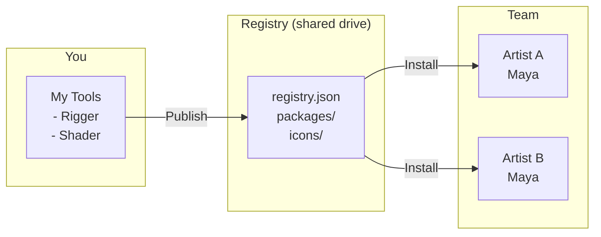
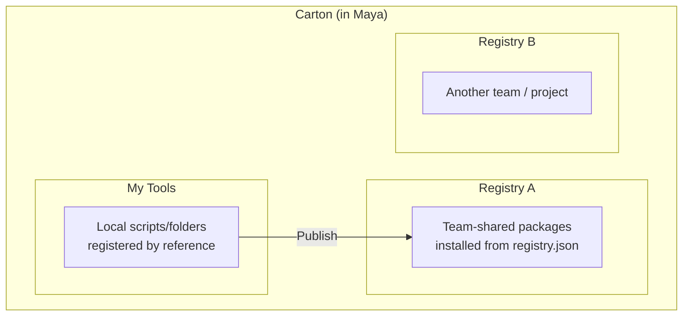

# Carton

A local-first package manager for Autodesk Maya.

[日本語版はこちら](README_ja.md)

## What is Carton?

Carton lets you **distribute, install, and update** Maya tools across your team without any cloud services. Everything runs on local directories or shared drives.



**Registry** = A shared folder containing `registry.json` + packaged tools.
Anyone with access can install tools from it.

## Key Concepts



- **My Tools** — Scripts you register locally. Reference-based: edits to the original files take effect immediately.
- **Registry** — A shared directory of packaged tools. Can be a local folder, network drive, Git repo, or remote URL.
- **Publish** — Package a local tool and add it to a registry so others can install it.

## Requirements

- Maya 2024 / 2025 / 2026 / 2027

## Quick Start

### Install Carton

1. Download an installer from [Releases](https://github.com/cignoir/carton/releases)
2. Drag & drop the `.py` file onto Maya's viewport
3. Restart Maya
4. Menu: **Carton > Open Carton**

### Use a Registry

```
Settings (⚙) > Add > select registry.json
```

Supports four sources:
- **Local file** — path to `registry.json`
- **GitHub repo** — `owner/repo` format
- **Remote URL** — direct URL to `registry.json`
- **Create new local registry** — pick an empty folder, Carton scaffolds `registry.json` and `packages/` for you

### Install a Tool

Open Carton, browse packages, click **Install**.

Carton verifies the package's SHA256 against the registry at download time,
and the card shows a small ✔ when the registry entry carries a hash. The
hash itself lives in the registry's `version_entry.sha256` (single source of
truth — the installed entry no longer duplicates it). Browse the **Version
History** from the package detail panel to see release notes for each
published version, or roll back to an older one — rolled-back packages are
**pinned** and skipped by future Update prompts so your manual choice isn't
undone on the next refresh.

### Register & Share Your Script

```
My Tools > + Add > select file or folder
                 > set name, icon, description
                 > Register

Card > Publish > select target registry, write release notes, ship it
```

See the [Registering tools to My Tools](#registering-tools-to-my-tools) section
below for per-type details.

Uninstalling a tool you previously published from the registry view does **not**
delete its My Tools registration — Carton just demotes the entry back to a
local-only registration, so your edit/launch state is independent from whether
the package is currently installed from the registry.

## Upgrading from v0.3

v0.4.0 bumps the registry / installed.json schemas to **v4.0**. Older files
are migrated in place on first startup; the original is preserved next to
the file as `installed.json.bak-v0.3.<ms>` / `registry.json.bak-v0.3.<ms>`.

Key changes:

- **Single source of truth per field.** `entry_point` lives only in the
  zip's inner `package.json`, `display_name` lives only in the registry,
  and `sha256` lives only in the registry's `version_entry` — the installed
  entry no longer duplicates any of them.
- **`source` enum collapsed** to `["registry","local"]`. Legacy values
  (`"published"`, `"local_script"`) auto-convert; double-bound entries
  (registry-installed AND My Tools-registered) are now expressed as
  `source="registry"` plus a non-empty `local_path`.
- **`registry_id` (UUID) is now required** on `registry.json` and is
  auto-stamped on first touch. Remote-only registries that ship without one
  trigger a warning (mirror matching cannot work until the maintainer
  stamps the canonical file).
- **`icon` is now `string | null`.** Legacy `"icon": true` (auto-resolve
  `<name>.png`) becomes the literal string `"@auto"`.
- **`platform` override.** A version-level `platform` array now overrides
  the package-level default; absent means inherit.

Registry maintainers should re-upload the migrated `registry.json` to
their host (S3, GitHub, etc.) so consumers pick up the new shape. Carton
0.3.x clients still parse a v4.0 registry — they just ignore the new
fields.

## Profiles

A **profile** is a saved set of runtime settings — registries, proxy, language,
auto-update. Switch profiles to flip your whole Carton between, say, "studio
work" and "personal" without re-adding registries by hand.

Profiles live as JSON files under `~/Documents/maya/carton/profiles/` (Windows)
or `~/maya/carton/profiles/` (macOS / Linux). The built-in `default` profile
always exists; create more from the **Profile Manager** (gear icon next to the
profile dropdown in the sidebar).

From the Profile Manager you can:

- **New** — create a profile seeded from your current Carton settings
- **Edit** — change registries / proxy / language / name
- **Reorder** — drag profiles around in the dropdown order
- **Build Installer…** — generate a custom drag-and-drop installer that
  pre-seeds the profile on first install. The recipient gets a Carton
  pre-configured with that profile selected.

Switching profiles is instant (no Maya restart). Installed packages are
shared across all profiles — a profile only swaps Carton-wide settings like
the registry list, proxy, and language.

## Strict Integrity Verification

Settings has a **Strict integrity verification** checkbox. When enabled,
Carton refuses to install any package whose registry entry doesn't carry a
SHA256, and treats hash mismatches as fatal. Recommended for shared or remote
registries where you want to be sure nobody has tampered with the bytes
between publish and install.

## Registry Structure

```
my-registry/
├── registry.json          # Package index
├── packages/
│   └── {namespace}/{name}/{version}/
│       └── {name}-{version}.zip
├── icons/
│   └── {name}.png         # Per-package icon
└── icons.zip              # Bundled icons for remote registries
```

Manage it with Git, put it on a network drive, or host it as static files — whatever works for your team.

## Registering tools to My Tools

"My Tools" is the local working area where you register tools by reference —
no copying. Edits to the original files take effect immediately. From My Tools
you can also Publish a tool to a registry to share it.

Carton supports several package types and auto-detects which one you're
adding. Below is what you can register and what to expect for each.

### 1. Single-file Python script (`.py`)

```
tools/
└── quick_rename.py        # def show(): ...
```

**Add**: pick the file in `+ Add > File`. Carton inspects the file for
`def show / run / main / execute` and prefills the function name. You can pick
a different function from the dropdown.

**Run modes**:
- **Function call** (default for `.py` with detected functions): Carton imports
  the module by basename and calls the chosen function — e.g.
  `import quick_rename; quick_rename.show()`.
- **Top-level execution**: the file is `exec()`'d as a script. Use this for
  scripts that do their work at module load time.

The file's parent directory is added to `sys.path` so the import works.

### 2. Single-file MEL script (`.mel`)

```
tools/
└── quickRename.mel        # global proc quickRename() { ... }
```

**Add**: pick the file. Carton enables MEL mode and uses the filename (without
extension) as both the script and the procedure name by default.

At launch Carton runs `source "quickRename.mel"; quickRename();` via
`maya.mel.eval`. The file's directory is added to `MAYA_SCRIPT_PATH`.

### 3. Maya plug-in (`.mll`)

```
plug-ins/
└── exAttrEditor.mll
```

**Add**: pick the file. Carton detects the `.mll` extension, registers the
plug-in's directory on `MAYA_PLUG_IN_PATH`, and shows an extra **Launch
command** field where you can enter an optional Python expression to run after
the plug-in loads (typically the command that opens the tool's UI). For
example:

```python
import maya.cmds as mc; mc.exAttrEditor(ui=True)
```

Clicking Launch loads the plug-in (if not already loaded) and runs the
command.

### 4. Folder package — Python (`python_package`)

A folder you intend to `import` as a Python package:

```
my_tool/
├── __init__.py            # def show(): ...
├── ui.py
└── package.json           # optional metadata
```

**Add**: pick the folder in `+ Add > Folder`. Carton:

- Reads `package.json` if present (preferred — see below).
- Otherwise auto-detects: it scans `__init__.py` for a function and walks the
  tree to guess the type.
- Adds the **parent** of the folder to `sys.path` so `import my_tool` works.

At launch: `import my_tool; my_tool.show()` (or the function you picked).

If you bundle a `package.json` in the folder root, Carton skips the run-mode
UI entirely and just trusts the metadata. This is the recommended way to make
folder packages portable across teams. See [package.json](#packagejson)
below.

### 5. Folder package — MEL (`mel_script`)

```
my_mel_tool/
├── scripts/
│   └── myTool.mel         # global proc myTool() { ... }
└── package.json           # optional, type: mel_script
```

**Add**: pick the folder. Carton finds the `scripts/` directory (or the folder
itself if there's no `scripts/`), adds it to `MAYA_SCRIPT_PATH`, and uses the
first `.mel` file as the script. At launch: `source "myTool.mel"; myTool();`.

### 6. Maya module (`maya_module`) — Autodesk Application Package / `.mod`

This is the format most third-party Maya tools ship in: a folder with
`PackageContents.xml` (or a `*.mod` file) plus `Contents/scripts`,
`Contents/plug-ins`, `Contents/icons`, and a `userSetup.py` that registers
menus or shelves.

```
SIWeightEditor/
├── PackageContents.xml
└── Contents/
    ├── scripts/
    │   ├── userSetup.py
    │   └── siweighteditor/
    │       └── __init__.py
    ├── plug-ins/
    │   └── win64/2024/
    │       └── bake_skin_weight.py
    └── icons/
```

**Add**: pick the folder. Carton detects the module layout and:

- Adds `Contents/scripts` to `sys.path` and `MAYA_SCRIPT_PATH`
- Walks `Contents/plug-ins` up to 3 levels deep (so nested layouts like
  `plug-ins/<plat>/<ver>/` are picked up) and adds every directory containing
  plug-in files to `MAYA_PLUG_IN_PATH`
- Adds `Contents/icons` to `XBMLANGPATH`, `Contents/presets` to
  `MAYA_PRESET_PATH`
- Executes `userSetup.py` deferred via `maya.utils.executeDeferred` so the
  module's own menu/shelf registration runs

The card shows an **Activate** button by default (no single window to
launch). Activation is idempotent within a session — clicking Activate twice
won't double-register menus.

#### Bind a Launch button to the module's main window

If you'd rather click **Launch** to open the module's UI directly, edit the
card and set the **Launch command** field to the Python expression that opens
the window. For SI Weight Editor:

```python
from siweighteditor import siweighteditor; siweighteditor.Option()
```

After saving, the card's button switches from Activate to Launch.

#### How to find the right launch command

Different tools name their entry function differently. In order of effort:

1. **Read the module's README / install guide** — easiest when it exists.
2. **Right-click an existing shelf button** for the tool → Edit → copy the
   command. Or in Maya: enable **Script Editor → History → Echo All
   Commands**, click the tool's menu item, and read the echoed command from
   the history.
3. **Grep `userSetup.py` and `startup.py`** for `runTimeCommand`, `menuItem
   -command`, or anything resembling `register*command`. The command string
   inside is the canonical entry point. (For SI Weight Editor that's how we
   found `siweighteditor.Option()`.)
4. **Search the source for top-level `def show / main / Go / open / run`** —
   common conventions for "open the main window" functions.
5. **Last resort**: find the main `QMainWindow` / `QDialog` subclass and
   instantiate it directly. Be aware some tools do important setup (loading
   resources, paths, plug-ins) in their entry function — instantiating the
   window class directly may give you a half-broken UI.

### 7. Folder package — `.mll` plugin bundle (`plugin`)

```
my_plugin/
├── plug-ins/
│   └── myPlugin.mll
├── scripts/
│   └── helper.py
└── package.json           # type: plugin
```

This is for plug-ins that ship alongside helper scripts as a unit. Carton
adds `plug-ins/` to `MAYA_PLUG_IN_PATH` and `scripts/` to both `sys.path` and
`MAYA_SCRIPT_PATH`. Auto-load can be enabled via `entry_point.auto_load: true`
in `package.json`.

### Namespace and the Internal Name

Every package has an **internal name** (a slug like `quick_rename` or
`ari-mirror`), shown read-only in the Add and Edit dialogs. It's derived
from the file or folder name and is the package's stable identifier — it
cannot be changed after registration without orphaning the registry entry.

The **namespace** field is optional during Add (you can register tools for
your own use without one) but **required to publish**. If you type
`MyStudio` it gets auto-converted to `mystudio`; the canonical form is
shown live below the input.

## package.json

Place this in your tool's root to define metadata:

```json
{
  "namespace": "mystudio",
  "name": "my_tool",
  "display_name": "My Tool",
  "version": "1.0.0",
  "type": "python_package",
  "description": "What this tool does",
  "author": "your_name",
  "maya_versions": ["2024", "2025", "2026", "2027"],
  "entry_point": {
    "type": "python",
    "module": "my_tool",
    "function": "show"
  },
  "icon": "🔧",
  "home_registry": { "name": "studio-main" }
}
```

Supported types: `python_package`, `mel_script`, `plugin`, `maya_module`

`package.json` is the **source of truth** for `entry_point`, `maya_versions`,
and `icon`. The publisher copies them into `registry.json` (as previews)
and into the package zip; at install time Carton reads them from the zip's
inner `package.json` rather than trusting any cached copy.

`icon` accepts:

- An emoji (e.g. `"🔧"`)
- A relative file path (e.g. `"resources/icon.png"`)
- The literal `"@auto"` to use `icons/<name>.png` from the registry
- `null` for no icon

### Identity model

Packages are identified by **`namespace/name`** (npm-style, e.g. `mystudio/rigger`).
Both fields are lowercase (`a-z 0-9 - _`). The `namespace` is **required to publish**;
locally-registered tools that you don't intend to share can omit it.

Once `namespace`/`name` live in `package.json`, **commit the file** so that other
people who clone your source converge on the same identity automatically — Add /
Publish on their side will update the same registry entry instead of creating a
duplicate.

### Single-file scripts (sidecar)

A single `.py` / `.mel` / `.mll` script has nowhere to put `package.json`, so
Carton uses a **sidecar** named `<filename>.carton.json` placed next to it:

```
tools/
├── quickRename.mel
└── quickRename.mel.carton.json   ← commit this alongside the script
```

The sidecar carries the same fields as `package.json`. Carton creates it
automatically the first time you publish.

## CLI

```bash
python -m carton list path/to/registry.json
python -m carton unpublish --registry path/to/registry.json --id mystudio/rigger

# Inspect or stamp the registry's UUID (required on v4.0 registries)
python -m carton registry id path/to/registry.json
python -m carton registry id path/to/registry.json --stamp
```

## Development

```bash
# Build installers
python scripts/build_installer.py

# Run tests
python -m pytest tests/ -v

# Dev reload in Maya
exec(open(r"path/to/carton/scripts/dev_reload.py", encoding="utf-8").read())
```

## License

MIT
