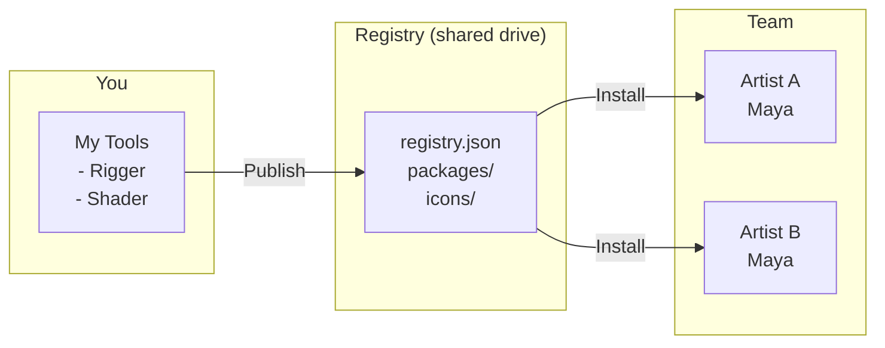
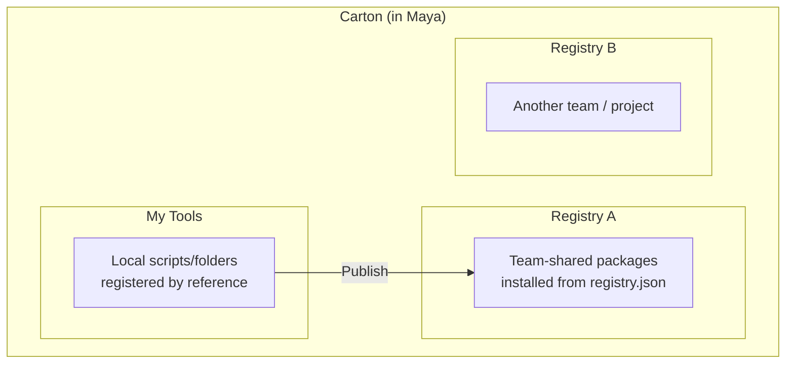

# Carton

A local-first package manager for Autodesk Maya.

[日本語版はこちら](README_ja.md)

## What is Carton?

Carton lets you **distribute, install, and update** Maya tools across your team without any cloud services. Everything runs on local directories or shared drives.



**Registry** = A shared folder containing `registry.json` + packaged tools.
Anyone with access can install tools from it.

## Key Concepts



- **My Tools** — Scripts you register locally. Reference-based: edits to the original files take effect immediately.
- **Registry** — A shared directory of packaged tools. Can be a local folder, network drive, Git repo, or remote URL.
- **Publish** — Package a local tool and add it to a registry so others can install it.

## Requirements

- Maya 2024 / 2025 / 2026 / 2027

## Quick Start

### Install Carton

1. Download an installer from [Releases](https://github.com/cignoir/carton/releases)
2. Drag & drop the `.py` file onto Maya's viewport
3. Restart Maya
4. Menu: **Carton > Open Carton**

### Use a Registry

```
Settings (⚙) > Add > select registry.json
```

Supports three sources:
- **Local file** — path to `registry.json`
- **GitHub repo** — `owner/repo` format
- **Remote URL** — direct URL to `registry.json`

### Install a Tool

Open Carton, browse packages, click **Install**.

### Register & Share Your Script

```
My Tools > + Add > select file or folder
                 > set name, icon, description
                 > Register

Card > Publish > select target registry
```

## Registry Structure

```
my-registry/
├── registry.json          # Package index
├── packages/
│   └── {uuid}/{version}/
│       └── {name}-{version}.zip
├── icons/
│   └── {name}.png         # Per-package icon
└── icons.zip              # Bundled icons for remote registries
```

Manage it with Git, put it on a network drive, or host it as static files — whatever works for your team.

## package.json

Place this in your tool's root to define metadata:

```json
{
  "namespace": "mystudio",
  "name": "my_tool",
  "display_name": "My Tool",
  "version": "1.0.0",
  "type": "python_package",
  "description": "What this tool does",
  "author": "your_name",
  "entry_point": {
    "type": "python",
    "module": "my_tool",
    "function": "show"
  },
  "icon": "🔧",
  "home_registry": { "name": "studio-main" }
}
```

Supported types: `python_package`, `mel_script`, `plugin`

### Identity model

Packages are identified by **`namespace/name`** (npm-style, e.g. `mystudio/rigger`).
Both fields are lowercase (`a-z 0-9 - _`). The `namespace` is **required to publish**;
locally-registered tools that you don't intend to share can omit it.

Once `namespace`/`name` live in `package.json`, **commit the file** so that other
people who clone your source converge on the same identity automatically — Add /
Publish on their side will update the same registry entry instead of creating a
duplicate.

### Single-file scripts (sidecar)

A single `.py` / `.mel` / `.mll` script has nowhere to put `package.json`, so
Carton uses a **sidecar** named `<filename>.carton.json` placed next to it:

```
tools/
├── quickRename.mel
└── quickRename.mel.carton.json   ← commit this alongside the script
```

The sidecar carries the same fields as `package.json`. Carton creates it
automatically the first time you publish.

## CLI

```bash
python -m carton list path/to/registry.json
python -m carton unpublish --registry path/to/registry.json --id mystudio/rigger
python -m carton migrate-registry --registry path/to/registry.json --namespace mystudio [--dry-run]
```

`migrate-registry` upgrades a legacy UUID-keyed registry to the namespace/name
model: rewrites `registry.json` keys, repacks every stored zip's inner
`package.json`, restructures `packages/<uuid>/...` into `packages/<ns>/<name>/...`,
and rebuilds `icons.zip`.

## Development

```bash
# Build installers
python scripts/build_installer.py

# Run tests
python -m pytest tests/ -v

# Dev reload in Maya
exec(open(r"path/to/carton/scripts/dev_reload.py", encoding="utf-8").read())
```

## License

MIT
