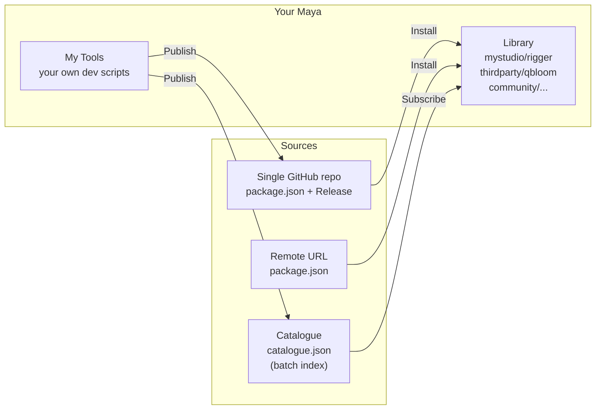
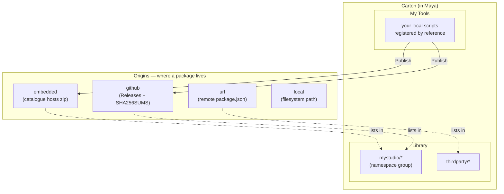

# Carton

A local-first package manager for Autodesk Maya.

[日本語版はこちら](README_ja.md)

## What is Carton?

Carton installs, updates, and shares Maya tools. **Packages are first-class**:
you install a tool by its `namespace/name`, regardless of where its bytes come
from — a single GitHub repo, a remote URL, a shared-drive index, or a local
folder. No cloud service required; everything runs on file paths, URLs, or
shared drives you already have.



Three ways to get a tool:

1. **Single GitHub repo** — paste `owner/repo`, Carton probes `package.json`
   and installs.
2. **Direct URL** — paste a URL to a `package.json` hosted anywhere.
3. **Catalogue subscription** — add a `catalogue.json` URL / path that indexes
   many packages at once (useful for studio-internal distribution).

## Concepts



- **Package** — identified by `namespace/name` (npm-style, e.g.
  `mystudio/rigger`). Same package can be indexed in multiple catalogues; it
  still installs as one thing.
- **Origin** — *where* a package's bytes live. Four types:
  `embedded` (catalogue hosts the zip), `github` (GitHub Releases), `url`
  (arbitrary hosted `package.json`), `local` (filesystem path).
- **Catalogue** — an *optional* index (`catalogue.json`) that lists multiple
  packages and where each one's origin is. Useful for studios or communities
  distributing many tools at once. A package doesn't need to be in a catalogue
  — you can install it directly from a GitHub repo or URL.
- **My Tools** — your own local scripts, registered by reference (edits take
  effect immediately). Publishable to an origin (GitHub Release or embedded
  catalogue) when you're ready to share.

### Pinned vs. unpinned sources

Every install resolves to an artifact with or without an authoritative SHA256:

- **Pinned** — the catalogue lists a SHA256, or the GitHub Release ships a
  `SHA256SUMS` sibling. Carton verifies every download against that hash.
- **Unpinned** — no authoritative hash (typical of GitHub's auto-generated
  tag archives). Carton records the first-fetch hash (trust-on-first-use) so
  later installs still detect tampering; **Strict Verify** refuses these
  entirely.

Library cards show a quiet ✓ when the source is pinned. Unpinned sources
show nothing — silence is the convention, Strict Verify turns them into a
visible install refusal.

## Requirements

- Maya 2024 / 2025 / 2026 / 2027

## Quick Start

### Install Carton

1. Download an installer from [Releases](https://github.com/cignoir/carton/releases)
2. Drag & drop the `.py` file onto Maya's viewport
3. Restart Maya
4. Menu: **Carton > Open Carton**

### Add a Package

```
Settings (⚙) > Add
```

The picker asks two questions. **Step 1 — what are you adding?**

- 📦 **Single package** — add one tool directly (the common case).
- 📚 **Catalogue** — connect to a multi-tool distribution (for authors
  / teams curating many tools at once).

**Step 2 — where from?** (options depend on Step 1; `← Back` returns to
Step 1.)

Single package:

- **GitHub repository** — `owner/repo`. Carton first probes `package.json`
  (single-tool repo) and falls back to `catalogue.json` (multi-tool repo).
- **Single package by URL** — direct URL to a `package.json` hosted anywhere.

Catalogue:

- **Local catalogue file** — path to a `catalogue.json` on a shared drive or
  local filesystem.
- **Remote catalogue URL** — URL to a `catalogue.json` (batch subscription).
- **Create new local catalogue** — scaffold an empty catalogue for your
  studio to publish into.

Single-package adds go into a machine-local *personal* store at
`~/.carton/`; catalogue subscriptions land in your Carton profile. Either
way, the Library view merges everything by namespace so you browse packages
without worrying about source.

### Install a Tool

Open Carton, pick a namespace in the Library sidebar, click **Install**.

The detail panel has **Version History** for release notes and rollback.
Rolled-back packages are **pinned** and won't be updated automatically until
you unpin them.

### Register & Share Your Script

```
My Tools > + Add > select file or folder
                 > set name, icon, description
                 > Register

Card > Publish > pick target (GitHub repo or embedded catalogue)
              > write release notes > ship it
```

See [Registering tools to My Tools](#registering-tools-to-my-tools) below for
per-type details. Uninstalling a published tool from the Library view does
**not** delete its My Tools registration — Carton just demotes it back to a
local-only entry.

## Upgrading

### From v0.4 to v0.5

v0.5.0 ships the **Package-first model** and bumps the catalogue schema
from 4.0 to 5.0: packages exist independently of catalogues, origins are
a first-class concept, and single-package GitHub repos work without
needing a `catalogue.json` wrapper.

> **⚠️ Breaking changes** — read this section before upgrading a shared
> catalogue.

- **Hard cut-over, no coexistence.** v0.4 clients cannot read v0.5
  catalogues (the filename itself changed: `registry.json` →
  `catalogue.json`, and the inner shape is different). Everyone on a
  shared catalogue needs to upgrade in lockstep.
- **Catalogue maintainers must re-upload.** After the auto-migration
  runs on your machine, push the resulting `catalogue.json` (and the
  unchanged `packages/` tree) back to your host so consumers pick up
  the new shape.
- **Python API:** the `RegistryClient` class has been removed. External
  consumers should import `CatalogueClient` from
  `carton.core.catalogue_client` — same surface, with `registry_*`
  symbols renamed to `catalogue_*`.
- **Field renames** in both `installed.json` and published
  `package.json`: `registry_id` → `catalogue_id`, `home_registry` →
  `home_origin` (a tagged union over `embedded` / `github` / `url` /
  `local`). Pre-v0.5.0 artifacts carrying only `home_registry` no
  longer pre-fill home info on re-register; republishing re-stamps
  `home_origin` from the target.
- **CLI flag rename:** `python -m carton unpublish --registry ...` is
  now `--catalogue ...`.

**Automatic migrations on first launch:**

- `registry.json` → `catalogue.json` in place; the original is preserved as
  `registry.json.bak-v0.4.<ms>` for rollback. Each package entry is rewritten
  to the new shape with `origin: {"type": "embedded", "versions": {...}}`.
- `registry_id` → `catalogue_id` (UUID preserved in config / catalogue
  files).

**UI / terminology changes:**

- "Registries" → "Catalogues" throughout the UI.
- Library sidebar now groups by namespace instead of per-catalogue row.
  Catalogue management moves to Settings → Catalogues.
- `Add` picker is now a **two-step dialog**: pick scope (single package
  / catalogue) first, then the transport. The five previous entry
  flows are still available, just grouped under the scope they belong
  to.

CLI helper for catalogue maintainers upgrading by hand:

```bash
python -m carton catalogue migrate path/to/registry.json
```

### From v0.3 to v0.4

v0.4.0 bumped the registry schema to v4.0 (SHA256 moved into the registry
entry as source-of-truth, `registry_id` UUID stamped on first touch, `source`
enum collapsed to `["registry","local"]`). Files are migrated in place on
first startup with `.bak-v0.3.<ms>` preserved for rollback.

## Profiles

A **profile** is a saved set of runtime settings — catalogues, proxy,
language, auto-update. Switch profiles to flip your whole Carton between,
say, "studio work" and "personal" without re-adding catalogues by hand.

Profiles live as JSON files under `~/Documents/maya/carton/profiles/` (Windows)
or `~/maya/carton/profiles/` (macOS / Linux). The built-in `default` profile
always exists; create more from the **Profile Manager** (gear icon next to the
profile dropdown in the sidebar).

From the Profile Manager you can:

- **New** — create a profile seeded from your current Carton settings
- **Edit** — change catalogues / proxy / language / name
- **Reorder** — drag profiles around in the dropdown order
- **Build Installer…** — generate a custom drag-and-drop installer that
  pre-seeds the profile on first install. The recipient gets a Carton
  pre-configured with that profile selected.

Switching profiles is instant (no Maya restart). Installed packages are
shared across all profiles — a profile only swaps Carton-wide settings like
the catalogue list, proxy, and language.

## Strict Integrity Verification

Settings has a **Strict integrity verification** checkbox. When enabled,
Carton refuses to install any package whose catalogue entry doesn't carry a
SHA256 and refuses any unpinned origin (GitHub auto archive, etc.); hash
mismatches become fatal. Recommended for shared or remote catalogues where
you want to be sure nobody has tampered with the bytes between publish and
install.

## Catalogue Structure

An **embedded** catalogue (one that hosts its own package zips) looks like:

```
my-catalogue/
├── catalogue.json          # Package index (v5.0)
├── packages/
│   └── {namespace}/{name}/{version}/
│       └── {name}-{version}.zip
├── icons/
│   └── {name}.png          # Per-package icon
└── icons.zip               # Bundled icons for remote catalogues
```

`catalogue.json` shape (v5.0):

```json
{
  "schema_version": "5.0",
  "catalogue_id": "<UUID>",
  "display_name": "MyStudio Tools",
  "packages": {
    "mystudio/rigger": {
      "origin": {"type": "github", "repo": "mystudio/rigger"}
    },
    "mystudio/shader-studio": {
      "origin": {
        "type": "embedded",
        "latest_version": "1.0.0",
        "versions": {
          "1.0.0": {
            "download_url": "packages/mystudio/shader-studio/1.0.0/shader-studio-1.0.0.zip",
            "sha256": "<64hex>",
            "size_bytes": 12345,
            "maya_versions": ["2024", "2025", "2026"],
            "released_at": "2026-03-…"
          }
        }
      }
    },
    "thirdparty/qbloom": {
      "origin": {"type": "url", "url": "https://example.com/qbloom-package.json"}
    }
  }
}
```

Only `embedded` origins carry `versions` inline — `github` / `url` / `local`
resolve versions dynamically (GitHub Releases API, remote `package.json`,
local file). Manage your catalogue with Git, put it on a network drive, or
host it as static files — whatever works for your team.

## Registering tools to My Tools

"My Tools" is the local working area where you register tools by reference —
no copying. Edits to the original files take effect immediately. From My Tools
you can also Publish a tool to a catalogue (or a GitHub repo) to share it.

Carton supports several package types and auto-detects which one you're
adding. Below is what you can register and what to expect for each.

### 1. Single-file Python script (`.py`)

```
tools/
└── quick_rename.py        # def show(): ...
```

**Add**: pick the file in `+ Add > File`. Carton inspects the file for
`def show / run / main / execute` and prefills the function name. You can pick
a different function from the dropdown.

**Run modes**:
- **Function call** (default for `.py` with detected functions): Carton imports
  the module by basename and calls the chosen function — e.g.
  `import quick_rename; quick_rename.show()`.
- **Top-level execution**: the file is `exec()`'d as a script. Use this for
  scripts that do their work at module load time.

The file's parent directory is added to `sys.path` so the import works.

### 2. Single-file MEL script (`.mel`)

```
tools/
└── quickRename.mel        # global proc quickRename() { ... }
```

**Add**: pick the file. Carton enables MEL mode and uses the filename (without
extension) as both the script and the procedure name by default.

At launch Carton runs `source "quickRename.mel"; quickRename();` via
`maya.mel.eval`. The file's directory is added to `MAYA_SCRIPT_PATH`.

### 3. Maya plug-in (`.mll`)

```
plug-ins/
└── exAttrEditor.mll
```

**Add**: pick the file. Carton detects the `.mll` extension, registers the
plug-in's directory on `MAYA_PLUG_IN_PATH`, and shows an extra **Launch
command** field where you can enter an optional Python expression to run after
the plug-in loads (typically the command that opens the tool's UI). For
example:

```python
import maya.cmds as mc; mc.exAttrEditor(ui=True)
```

Clicking Launch loads the plug-in (if not already loaded) and runs the
command.

### 4. Folder package — Python (`python_package`)

A folder you intend to `import` as a Python package:

```
my_tool/
├── __init__.py            # def show(): ...
├── ui.py
└── package.json           # optional metadata
```

**Add**: pick the folder in `+ Add > Folder`. Carton:

- Reads `package.json` if present (preferred — see below).
- Otherwise auto-detects: it scans `__init__.py` for a function and walks the
  tree to guess the type.
- Adds the **parent** of the folder to `sys.path` so `import my_tool` works.

At launch: `import my_tool; my_tool.show()` (or the function you picked).

If you bundle a `package.json` in the folder root, Carton skips the run-mode
UI entirely and just trusts the metadata. This is the recommended way to make
folder packages portable across teams. See [package.json](#packagejson)
below.

### 5. Folder package — MEL (`mel_script`)

```
my_mel_tool/
├── scripts/
│   └── myTool.mel         # global proc myTool() { ... }
└── package.json           # optional, type: mel_script
```

**Add**: pick the folder. Carton finds the `scripts/` directory (or the folder
itself if there's no `scripts/`), adds it to `MAYA_SCRIPT_PATH`, and uses the
first `.mel` file as the script. At launch: `source "myTool.mel"; myTool();`.

### 6. Maya module (`maya_module`) — Autodesk Application Package / `.mod`

This is the format most third-party Maya tools ship in: a folder with
`PackageContents.xml` (or a `*.mod` file) plus `Contents/scripts`,
`Contents/plug-ins`, `Contents/icons`, and a `userSetup.py` that registers
menus or shelves.

```
SIWeightEditor/
├── PackageContents.xml
└── Contents/
    ├── scripts/
    │   ├── userSetup.py
    │   └── siweighteditor/
    │       └── __init__.py
    ├── plug-ins/
    │   └── win64/2024/
    │       └── bake_skin_weight.py
    └── icons/
```

**Add**: pick the folder. Carton detects the module layout and:

- Adds `Contents/scripts` to `sys.path` and `MAYA_SCRIPT_PATH`
- Walks `Contents/plug-ins` up to 3 levels deep (so nested layouts like
  `plug-ins/<plat>/<ver>/` are picked up) and adds every directory containing
  plug-in files to `MAYA_PLUG_IN_PATH`
- Adds `Contents/icons` to `XBMLANGPATH`, `Contents/presets` to
  `MAYA_PRESET_PATH`
- Executes `userSetup.py` deferred via `maya.utils.executeDeferred` so the
  module's own menu/shelf registration runs

The card shows an **Activate** button by default (no single window to
launch). Activation is idempotent within a session — clicking Activate twice
won't double-register menus.

#### Bind a Launch button to the module's main window

If you'd rather click **Launch** to open the module's UI directly, edit the
card and set the **Launch command** field to the Python expression that opens
the window. For SI Weight Editor:

```python
from siweighteditor import siweighteditor; siweighteditor.Option()
```

After saving, the card's button switches from Activate to Launch.

#### How to find the right launch command

Different tools name their entry function differently. In order of effort:

1. **Read the module's README / install guide** — easiest when it exists.
2. **Right-click an existing shelf button** for the tool → Edit → copy the
   command. Or in Maya: enable **Script Editor → History → Echo All
   Commands**, click the tool's menu item, and read the echoed command from
   the history.
3. **Grep `userSetup.py` and `startup.py`** for `runTimeCommand`, `menuItem
   -command`, or anything resembling `register*command`. The command string
   inside is the canonical entry point. (For SI Weight Editor that's how we
   found `siweighteditor.Option()`.)
4. **Search the source for top-level `def show / main / Go / open / run`** —
   common conventions for "open the main window" functions.
5. **Last resort**: find the main `QMainWindow` / `QDialog` subclass and
   instantiate it directly. Be aware some tools do important setup (loading
   resources, paths, plug-ins) in their entry function — instantiating the
   window class directly may give you a half-broken UI.

### 7. Folder package — `.mll` plugin bundle (`plugin`)

```
my_plugin/
├── plug-ins/
│   └── myPlugin.mll
├── scripts/
│   └── helper.py
└── package.json           # type: plugin
```

This is for plug-ins that ship alongside helper scripts as a unit. Carton
adds `plug-ins/` to `MAYA_PLUG_IN_PATH` and `scripts/` to both `sys.path` and
`MAYA_SCRIPT_PATH`. Auto-load can be enabled via `entry_point.auto_load: true`
in `package.json`.

### Namespace and the Internal Name

Every package has an **internal name** (a slug like `quick_rename` or
`ari-mirror`), shown read-only in the Add and Edit dialogs. It's derived
from the file or folder name and is the package's stable identifier — it
cannot be changed after registration without orphaning the catalogue entry.

The **namespace** field is optional during Add (you can register tools for
your own use without one) but **required to publish**. If you type
`MyStudio` it gets auto-converted to `mystudio`; the canonical form is
shown live below the input.

## package.json

Place this in your tool's root to define metadata:

```json
{
  "namespace": "mystudio",
  "name": "my_tool",
  "display_name": "My Tool",
  "version": "1.0.0",
  "type": "python_package",
  "description": "What this tool does",
  "author": "your_name",
  "maya_versions": ["2024", "2025", "2026", "2027"],
  "entry_point": {
    "type": "python",
    "module": "my_tool",
    "function": "show"
  },
  "icon": "🔧",
  "home_origin": {"type": "embedded", "catalogue_name": "studio-main"}
}
```

Supported types: `python_package`, `mel_script`, `plugin`, `maya_module`

`package.json` is the **source of truth** for `entry_point`, `maya_versions`,
and `icon`. The publisher copies them into the target catalogue (as previews)
and into the package zip; at install time Carton reads them from the zip's
inner `package.json` rather than trusting any cached copy.

`icon` accepts:

- An emoji (e.g. `"🔧"`)
- A relative file path (e.g. `"resources/icon.png"`)
- The literal `"@auto"` to use `icons/<name>.png` from the catalogue
- `null` for no icon

`home_origin` records where this package likes to be published (embedded
catalogue / github repo / url / local). It's a tagged union over the four
origin types and replaces the v0.4 `home_registry` field.

### Identity model

Packages are identified by **`namespace/name`** (npm-style, e.g. `mystudio/rigger`).
Both fields are lowercase (`a-z 0-9 - _`). The `namespace` is **required to publish**;
locally-registered tools that you don't intend to share can omit it.

Once `namespace`/`name` live in `package.json`, **commit the file** so that other
people who clone your source converge on the same identity automatically — Add /
Publish on their side will update the same catalogue entry instead of creating a
duplicate.

### Single-file scripts (sidecar)

A single `.py` / `.mel` / `.mll` script has nowhere to put `package.json`, so
Carton uses a **sidecar** named `<filename>.carton.json` placed next to it:

```
tools/
├── quickRename.mel
└── quickRename.mel.carton.json   ← commit this alongside the script
```

The sidecar carries the same fields as `package.json`. Carton creates it
automatically the first time you publish.

## CLI

```bash
# List packages in a catalogue or registry
python -m carton list path/to/catalogue.json

# Unpublish a package from a catalogue
python -m carton unpublish --catalogue path/to/catalogue.json --id mystudio/rigger

# Migrate a v0.4 registry.json into a v5.0 catalogue.json in place
python -m carton catalogue migrate path/to/registry.json

# Inspect or stamp a v5.0 catalogue's UUID
python -m carton catalogue id path/to/catalogue.json
python -m carton catalogue id path/to/catalogue.json --stamp
```

## Development

```bash
# Build installers
python scripts/build_installer.py

# Run tests (Qt smoke tests require pytest-qt; offscreen platform is auto-set)
pip install pytest-qt
python -m pytest tests/ -v

# Dev reload in Maya
exec(open(r"path/to/carton/scripts/dev_reload.py", encoding="utf-8").read())
```

See [docs/design-faq.md](docs/design-faq.md) for intentional non-decisions
("why isn't dependency resolution a thing?", "why no Cartonfile?", etc.) —
useful context before proposing new features.

## License

MIT
