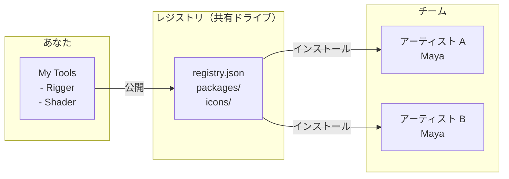
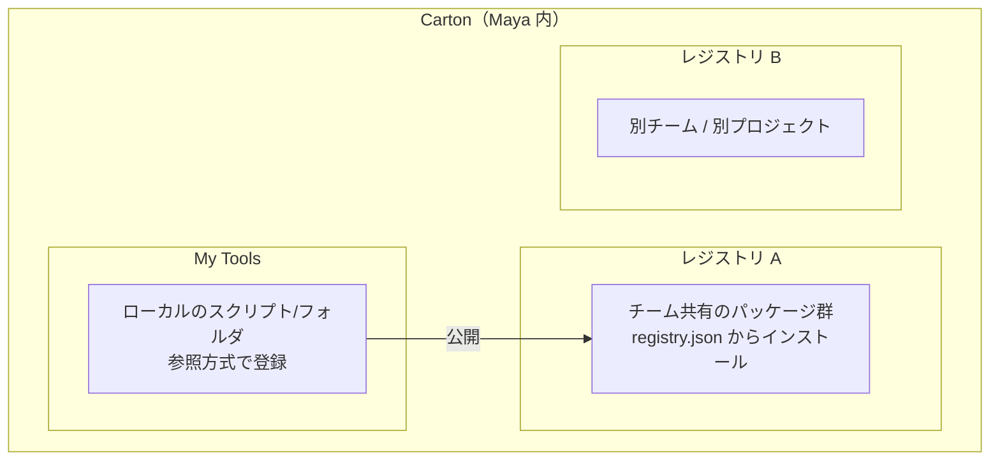

# Carton

Maya 用ローカルファーストのパッケージマネージャ。

[English version](README.md)

## Carton とは？

Carton は Maya ツールの**配布・インストール・更新**をクラウド不要で行えるパッケージマネージャです。共有ドライブやローカルディレクトリだけで運用できます。



**レジストリ** = `registry.json` とパッケージ群を含む共有フォルダ。
アクセス権があれば誰でもツールをインストールできます。

## 基本コンセプト



- **My Tools** — ローカル登録したスクリプト。参照方式なので、元ファイルの編集が即反映されます。
- **レジストリ** — パッケージをまとめた共有ディレクトリ。ローカルフォルダ、ネットワークドライブ、Git リポジトリ、リモート URL に対応。
- **公開（Publish）** — ローカルツールをパッケージ化してレジストリに追加。チームメンバーがインストール可能になります。

## 動作環境

- Maya 2024 / 2025 / 2026 / 2027

## クイックスタート

### Carton のインストール

1. [Releases](https://github.com/cignoir/carton/releases) からインストーラをダウンロード
2. Maya のビューポートに `.py` ファイルをドラッグ＆ドロップ
3. Maya を再起動
4. メニュー: **Carton > Open Carton**

### レジストリを使う

```
Settings（⚙）> Add > registry.json を選択
```

4 つのソースに対応:
- **ローカルファイル** — `registry.json` のパスを指定
- **GitHub リポジトリ** — `owner/repo` 形式
- **リモート URL** — `registry.json` の直接 URL
- **新規ローカルレジストリ作成** — 空フォルダを選ぶと `registry.json` と `packages/` を Carton が自動生成

### ツールをインストール

Carton を開き、パッケージを選んで **Install** をクリック。

インストールしたパッケージはレジストリ側の SHA256 と一緒に記録され、ダウンロード時に
照合が成功したカードには小さな ✔ マークが付きます。詳細パネルから **Version
History** を開けば各バージョンのリリースノートを参照したり、旧バージョンに
**Rollback** することもできます。ロールバックしたパッケージは **Pinned**（固定）
扱いになり、以降の Update プロンプトでスキップされるので、自分で選んだバージョンが
勝手に上書きされません。

### スクリプトを登録・共有

```
My Tools > + Add > ファイルまたはフォルダを選択
                 > 名前、アイコン、説明を設定
                 > Register

カード > Publish > 公開先レジストリを選択、リリースノートを書いて公開
```

タイプ別の詳しい登録方法は下の [マイツールへの登録](#マイツールへの登録) を参照。

公開済みのツールをレジストリビューから Uninstall しても、My Tools 側の登録は
**消えません**。Carton はエントリを「local_script」に降格させるだけなので、編集や
起動の状態は「レジストリからインストールされているか」と独立して扱えます。

## プロファイル

**プロファイル**は registries / proxy / language / 自動更新といった Carton 全体の
設定をまとめて切替えるための保存済みセット。例えば「会社」と「個人」のプロファイルを
作っておけば、レジストリを毎回入れ直すことなく Carton 全体の挙動をワンクリックで
切替えられます。

プロファイルは JSON ファイルとして次の場所に保存されます：

| OS | パス |
|---|---|
| Windows | `~/Documents/maya/carton/profiles/` |
| macOS / Linux | `~/maya/carton/profiles/` |

組み込みの `default` プロファイルは常に存在します。追加プロファイルはサイドバーの
プロファイルドロップダウン横の歯車アイコンから開く **Profile Manager** で管理できます。

Profile Manager でできること:

- **New** — 現在の Carton 設定を seed に新規プロファイル作成
- **Edit** — registries / proxy / language / 名前 を変更
- **並び替え** — ▲▼ ボタンでドロップダウン上の順序を入れ替え
- **Build Installer…** — 選択中のプロファイルを seed に焼き込んだカスタムインストーラを
  生成。配布先で初回起動時にそのプロファイルが選択された状態で立ち上がります。

プロファイルの切替は即時反映（Maya 再起動不要）。インストール済みパッケージは全プロ
ファイルで共有され、プロファイルが切替えるのは「どのレジストリを見るか」「どの認証情報を
使って取得するか」だけです。

## 厳密な整合性検証

Settings に **「厳密な整合性検証」** チェックボックスがあります。有効にすると Carton は：

- レジストリエントリに SHA256 が無いパッケージのインストールを **拒否**
- ハッシュ不一致を **致命エラー** として扱う

共有・リモートレジストリを使う場合に推奨。公開時と取得時の間で誰かがバイトを
改ざんしていないことを保証できます。

## レジストリの構成

```
my-registry/
├── registry.json          # パッケージ一覧
├── packages/
│   └── {namespace}/{name}/{version}/
│       └── {name}-{version}.zip
├── icons/
│   └── {name}.png         # パッケージごとのアイコン
└── icons.zip              # リモート配信用アイコン一括ファイル
```

Git で管理するもよし、ネットワークドライブに置くもよし、静的ファイルとしてホスティングするもよし。

## マイツールへの登録

「マイツール」はローカルのツールを**参照方式**で登録する作業エリアです。
コピーは作らないので、元ファイルを編集すれば即反映されます。マイツールに
登録したツールは Publish でレジストリに共有できます。

Carton はいくつかのパッケージタイプをサポートしていて、追加時に自動判定し
ます。以下、登録できるものとタイプごとの挙動。

### 1. 単体 Python スクリプト（`.py`）

```
tools/
└── quick_rename.py        # def show(): ...
```

**追加**: `+ Add > File` でファイルを選択。Carton が
`def show / run / main / execute` を探して関数名を自動入力します。ドロップ
ダウンから別の関数を選ぶこともできます。

**実行モード**:
- **関数呼び出し**（関数が見つかった `.py` ではデフォルト）: ファイル名を
  モジュール名として import → 関数を呼び出し
  （`import quick_rename; quick_rename.show()`）
- **トップレベル実行**: ファイル全体を `exec()` で実行。モジュールロード時に
  処理を行うスクリプト向け。

ファイルの親ディレクトリが `sys.path` に追加されます。

### 2. 単体 MEL スクリプト（`.mel`）

```
tools/
└── quickRename.mel        # global proc quickRename() { ... }
```

**追加**: ファイルを選択。Carton が MEL モードに切り替え、ファイル名（拡張子
抜き）をスクリプト名・プロシージャ名のデフォルトとして使います。

起動時は `source "quickRename.mel"; quickRename();` を `maya.mel.eval` で
実行。ファイルのディレクトリが `MAYA_SCRIPT_PATH` に追加されます。

### 3. Maya プラグイン（`.mll`）

```
plug-ins/
└── exAttrEditor.mll
```

**追加**: ファイルを選択。Carton が `.mll` 拡張子を検知し、プラグインの
ディレクトリを `MAYA_PLUG_IN_PATH` に登録、さらに**起動コマンド**フィールド
（プラグインロード後に実行する Python 式）を表示します。例:

```python
import maya.cmds as mc; mc.exAttrEditor(ui=True)
```

起動ボタンをクリックするとプラグインがロード（未ロード時のみ）され、コマンド
が実行されます。

### 4. フォルダパッケージ — Python（`python_package`）

`import` 可能な Python パッケージとして配布したいフォルダ:

```
my_tool/
├── __init__.py            # def show(): ...
├── ui.py
└── package.json           # 任意のメタデータ
```

**追加**: `+ Add > Folder` でフォルダを選択。Carton は:

- `package.json` があればそれを優先（推奨。下記参照）
- なければ自動判定: `__init__.py` を読んで関数を探し、ツリーを walk して
  タイプを推測
- フォルダの**親ディレクトリ**を `sys.path` に追加して `import my_tool` が
  通るようにする

起動時: `import my_tool; my_tool.show()`（または選択した関数）。

`package.json` をフォルダルートに置いておくと Carton は実行モード UI を完全
にスキップしてメタデータを信頼します。チームでフォルダパッケージを共有する
ならこれが推奨。詳細は [package.json](#packagejson) を参照。

### 5. フォルダパッケージ — MEL（`mel_script`）

```
my_mel_tool/
├── scripts/
│   └── myTool.mel         # global proc myTool() { ... }
└── package.json           # 任意、type: mel_script
```

**追加**: フォルダを選択。Carton は `scripts/` ディレクトリ（無ければ
フォルダ自体）を見つけて `MAYA_SCRIPT_PATH` に追加し、最初の `.mel` ファイル
をスクリプトとして使います。起動時: `source "myTool.mel"; myTool();`。

### 6. Maya モジュール（`maya_module`） — Autodesk Application Package / `.mod`

サードパーティの Maya ツールで一番よくある形式: `PackageContents.xml`
（または `*.mod`）と `Contents/scripts`、`Contents/plug-ins`、
`Contents/icons`、メニューやシェルフを登録する `userSetup.py` を含むフォルダ。

```
SIWeightEditor/
├── PackageContents.xml
└── Contents/
    ├── scripts/
    │   ├── userSetup.py
    │   └── siweighteditor/
    │       └── __init__.py
    ├── plug-ins/
    │   └── win64/2024/
    │       └── bake_skin_weight.py
    └── icons/
```

**追加**: フォルダを選択。Carton がモジュール構造を検知して:

- `Contents/scripts` を `sys.path` と `MAYA_SCRIPT_PATH` に追加
- `Contents/plug-ins` を 1 階層 walk して（`plug-ins/<plat>/<ver>/` を拾える
  ように）各プラグインディレクトリを `MAYA_PLUG_IN_PATH` に追加
- `Contents/icons` を `XBMLANGPATH`、`Contents/presets` を
  `MAYA_PRESET_PATH` に追加
- `userSetup.py` を `maya.utils.executeDeferred` 経由で実行し、モジュール
  自身のメニュー/シェルフ登録が走る

カードのボタンはデフォルトで**有効化**（直接開くウィンドウが無いため）。
セッション内で冪等で、2 回クリックしてもメニューは二重登録されません。

#### 起動ボタンでメインウィンドウを直接開く

「有効化」ではなく「起動」でモジュールの UI を直接開きたい場合、カードを
編集して**起動コマンド**フィールドにウィンドウを開く Python 式を入力します。
SI Weight Editor の例:

```python
from siweighteditor import siweighteditor; siweighteditor.Option()
```

保存するとボタンが「有効化」から「起動」に切り替わります。

#### 正しい起動コマンドの探し方

ツールごとにエントリ関数名は違います。手間が少ない順に:

1. **モジュールの README / インストールガイドを読む** — あれば一番楽。
2. **既存のシェルフボタンがあれば右クリック → Edit でコマンドをコピー**。
   または Maya の **Script Editor → History → Echo All Commands** を ON にして
   ツールのメニューアイテムをクリック → 履歴に流れたコマンドを読む。
3. **`userSetup.py` と `startup.py` を grep**して `runTimeCommand`、
   `menuItem -command`、`register*command` らしきものを探す。コマンド文字列
   が正規のエントリポイントです。（SI Weight Editor もこれで
   `siweighteditor.Option()` を見つけました。）
4. **ソースから `def show / main / Go / open / run` のトップレベル関数**を
   探す — 「メインウィンドウを開く」関数の慣習的な名前。
5. **最終手段**: メイン `QMainWindow` / `QDialog` サブクラスを探して直接
   インスタンス化。ただし、ツールによってはエントリ関数で重要なセットアップ
   （リソース読み込み、パス設定、プラグインロード）をやってる場合があり、
   ウィンドウクラスを直接インスタンス化すると UI が崩れることもあります。

### 7. フォルダパッケージ — `.mll` プラグイン同梱（`plugin`）

```
my_plugin/
├── plug-ins/
│   └── myPlugin.mll
├── scripts/
│   └── helper.py
└── package.json           # type: plugin
```

ヘルパースクリプトと一緒に配布したい `.mll` プラグイン向け。Carton が
`plug-ins/` を `MAYA_PLUG_IN_PATH` に、`scripts/` を `sys.path` と
`MAYA_SCRIPT_PATH` に追加します。`package.json` で
`entry_point.auto_load: true` にすれば自動ロードも可能。

### Namespace と内部名（Internal Name）

すべてのパッケージには**内部名**（`quick_rename` や `ari-mirror` のような
スラッグ）があり、Add / Edit ダイアログで読み取り専用で表示されます。
ファイル名・フォルダ名から自動生成され、パッケージの安定識別子です。
**登録後の変更不可**（変えるとレジストリのエントリが孤立します）。

**Namespace** は Add 時は任意（個人用途のみなら省略可）ですが**公開時に必須**
です。`MyStudio` と入力すると自動で `mystudio` に変換され、入力欄の下に
正規化後の形式がライブ表示されます。

ツールのルートに配置するメタデータファイル:

```json
{
  "namespace": "mystudio",
  "name": "my_tool",
  "display_name": "My Tool",
  "version": "1.0.0",
  "type": "python_package",
  "description": "ツールの説明",
  "author": "your_name",
  "entry_point": {
    "type": "python",
    "module": "my_tool",
    "function": "show"
  },
  "icon": "🔧",
  "home_registry": { "name": "studio-main" }
}
```

対応タイプ: `python_package`, `mel_script`, `plugin`, `maya_module`

### 識別子モデル

パッケージは **`namespace/name`**（npm 風、例: `mystudio/rigger`）で識別されます。
両方とも小文字 `a-z 0-9 - _`。`namespace` は **publish 時に必須**で、ローカル
個人用途のみのツールでは省略できます。

`namespace`／`name` を `package.json` に書き込んだら、**そのファイルを VCS に
コミット**してください。同じソースを clone した別の人が Add／Publish しても
自動で同じ識別子になり、レジストリ上で**同じパッケージの更新**として扱われます
（重複登録を防ぎます）。

### 単体ファイルスクリプト（サイドカー）

単体の `.py` / `.mel` / `.mll` には `package.json` を置く場所がないので、
Carton は**サイドカー** `<filename>.carton.json` を同じディレクトリに置きます:

```
tools/
├── quickRename.mel
└── quickRename.mel.carton.json   ← スクリプトと一緒にコミット
```

サイドカーの中身は `package.json` と同じスキーマです。初回 publish 時に Carton
が自動生成するので、生成されたファイルをコミットしてチームに行き渡らせてください。

## CLI

```bash
python -m carton list path/to/registry.json
python -m carton unpublish --registry path/to/registry.json --id mystudio/rigger
python -m carton migrate-registry --registry path/to/registry.json --namespace mystudio [--dry-run]
```

`migrate-registry` は旧 UUID キー方式のレジストリを `namespace/name` 方式に
アップグレードします: `registry.json` のキーを書き換え、保存済み zip 内の
`package.json` を全て展開→書き換え→再 zip し、`packages/<uuid>/...` ツリーを
`packages/<ns>/<name>/...` に再配置、`icons.zip` を再構築します。

## 開発

```bash
# インストーラのビルド
python scripts/build_installer.py

# テスト
python -m pytest tests/ -v

# Maya での開発リロード
exec(open(r"path/to/carton/scripts/dev_reload.py", encoding="utf-8").read())
```

## ライセンス

MIT
