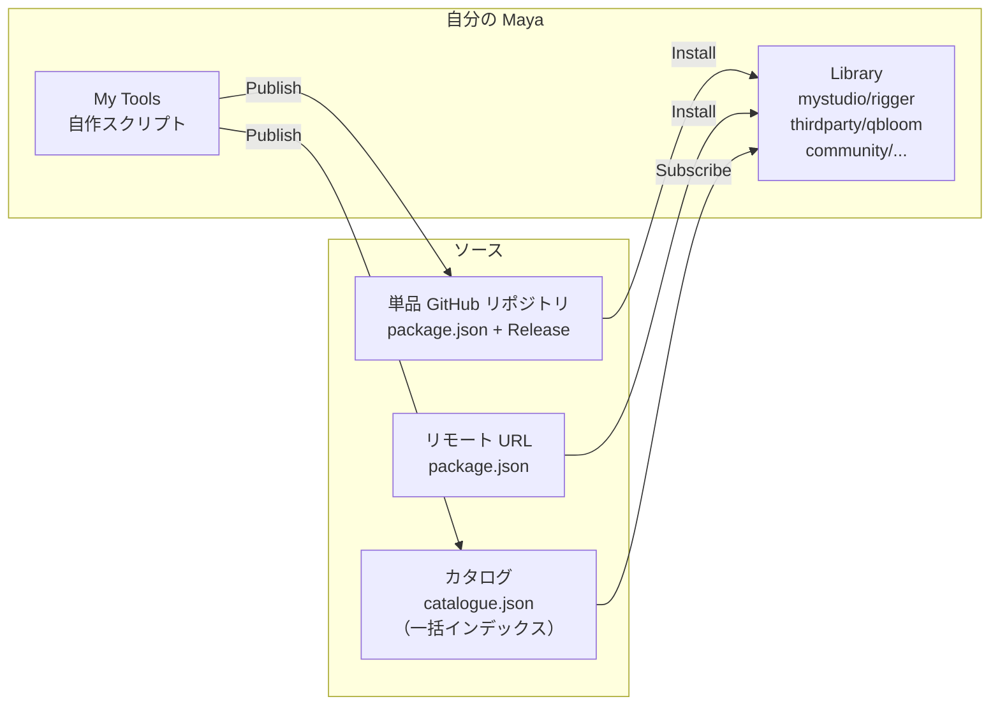
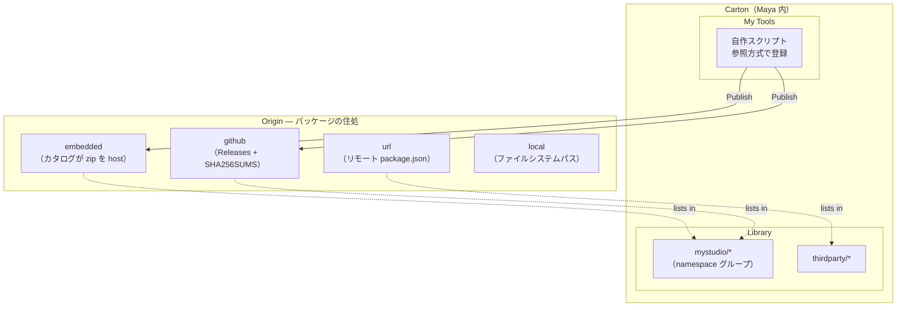

# Carton

Maya 向けのローカルファースト型パッケージマネージャー。

[English version](README.md)

## Carton とは

Carton は Maya ツールをインストール・更新・共有するためのツールです。**パッケージが主役**の設計で、`namespace/name` でツールを指定すればインストールが完結します — そのバイト列が単一の GitHub リポジトリから来ようが、任意の URL から来ようが、共有ドライブ上のインデックスから来ようが、関係ありません。クラウドサービスは不要で、ファイルパス・URL・共有ドライブだけで運用できます。



ツールの追加方法は 3 通り：

1. **単品 GitHub リポジトリ** — `owner/repo` を貼れば、Carton が `package.json` を探してインストール。
2. **直接 URL** — 任意の場所に置いた `package.json` の URL を貼ってインストール。
3. **カタログ購読** — 多数のパッケージを一度にインデックスした `catalogue.json` の URL / パスを追加（スタジオ内部の一括配布に便利）。

## 主要コンセプト



- **Package（パッケージ）** — `namespace/name` で識別（npm 風、例: `mystudio/rigger`）。同じパッケージが複数のカタログにインデックスされていても、インストールは 1 つのものとして扱われます。
- **Origin** — パッケージのバイト列が*どこに住んでいるか*。4 種類：`embedded`（カタログが zip を host）、`github`（GitHub Releases）、`url`（任意の場所の `package.json`）、`local`（ファイルシステムパス）。
- **Catalogue（カタログ）** — 複数のパッケージとそれぞれの origin を列挙した*オプショナルな*インデックス（`catalogue.json`）。スタジオやコミュニティが多数のツールを一括配布したい場合に便利です。パッケージがカタログに載っている必要は**ありません** — GitHub リポジトリや URL から直接インストールできます。
- **My Tools** — 自分のローカルスクリプトを参照方式で登録（編集が即反映）。共有したくなったら Origin（GitHub Release または embedded カタログ）に Publish できます。

### Pinned と unpinned

すべてのインストールは、正規の SHA256 付き／無しのアーティファクトに解決されます：

- **Pinned** — カタログが SHA256 を記載しているか、GitHub Release が `SHA256SUMS` を同梱している状態。Carton はダウンロード毎に同じハッシュで検証します。
- **Unpinned** — 正規ハッシュなし（GitHub の自動生成 tag archive などが典型）。Carton は初回 fetch 時のハッシュを記録（TOFU: trust-on-first-use）するので後続 install の改ざんは検出しますが、**厳密検証**モードではこれらを一切拒否します。

Library カードは pinned ソース時のみ控えめな ✓ を表示します。unpinned 側は表示なし — 「検証済の時だけ肯定表示」のコンベンションに従い、厳密検証モードで初めて目に見えるエラーに変わります。

## 動作環境

- Maya 2024 / 2025 / 2026 / 2027

## クイックスタート

### Carton をインストールする

1. [Releases](https://github.com/cignoir/carton/releases) からインストーラをダウンロードします。
2. ダウンロードした `.py` ファイルを Maya のビューポートにドラッグ＆ドロップします。
3. Maya を再起動します。
4. メニューから **Carton > Open Carton** を選択します。

### パッケージを追加する

```
Settings（⚙）> Add
```

手元にあるものに応じて追加方法を選びます：

- **GitHub リポジトリ** — `owner/repo`。Carton は `package.json` を先に探し（単品リポジトリ）、無ければ `catalogue.json` にフォールバック（複数パッケージのリポジトリ）。
- **単品パッケージを URL で追加** — 任意の場所にホスティングされた `package.json` への直 URL。
- **リモートカタログ URL** — `catalogue.json` の URL（一括購読）。
- **ローカルカタログファイル** — 共有ドライブやローカルにある `catalogue.json` のパス。
- **ローカルカタログを新規作成** — 空フォルダを選んで、スタジオが公開先にするカタログを立ち上げる。

単品追加はマシンローカルの *personal* ストア（`~/.carton/`）に保存され、カタログ購読は Carton プロファイルに登録されます。どちらにせよ Library ビューは namespace で統合表示するので、ソースを意識せずにパッケージを見られます。

### ツールをインストールする

Carton を開き、サイドバーから namespace を選び **Install** をクリック。

詳細パネルの **Version History** から各バージョンのリリースノート確認・ロールバックができます。ロールバック後のパッケージは **Pinned（固定）** になり、意図的に unpin するまで自動更新の対象外になります。

### スクリプトを登録・共有する

```
My Tools > + Add > ファイルまたはフォルダを選択
                 > 名前、アイコン、説明を設定
                 > Register

カード > Publish > 公開先（GitHub リポジトリ or embedded カタログ）を選択
              > リリースノートを書いて公開
```

タイプ別の詳しい登録手順は [マイツールへの登録](#マイツールへの登録) を参照してください。

レジストリビューから「自分が公開したツール」をアンインストールしても、My Tools 側の登録は**消えません**。Carton は単にエントリを「ローカルスクリプト」状態に戻すだけなので、インストール状態とは独立して編集や起動の設定を保持し続けます。

## 移行

### v0.4 から v5.0 へ

v5.0 は **Package-first モデル**を導入しました — パッケージはカタログから独立して存在し、origin が第一級概念となり、単品 GitHub リポジトリは `catalogue.json` ラッパー無しで動きます。

**初回起動時に自動 migrate される内容：**

- `registry.json` → `catalogue.json`（同じ場所で rename）、旧ファイルは `registry.json.bak-v0.4.<ms>` として退避。各 package エントリは新しい shape（`origin: {"type": "embedded", "versions": {...}}`）に書き換え。
- `registry_id` → `catalogue_id`（UUID は保持）。config / catalogue ファイル内で rename。
- publish 済みアーティファクトの `home_registry` は `home_origin`（embedded / github / url / local のタグドユニオン）に置き換わります。v0.5.0 より前の `home_registry` だけを持つアーティファクトは re-register 時に home 情報が拾われなくなりますが、再 publish すれば `home_origin` が新たに stamp されます。

**UI / 用語の変更：**

- UI 全体で「Registries」→「Catalogues」(「レジストリ」→「カタログ」)。
- Library サイドバーはカタログ別行から namespace グループ表示に変更。カタログ管理は Settings → Catalogues に集約。
- `Add` ダイアログは単品追加フロー（GitHub リポジトリ、単品パッケージを URL で追加）を先頭に配置。カタログ系フロー（リモートカタログ URL、ローカルカタログファイル、ローカルカタログを新規作成）も引き続き利用可能。

**カタログ管理者向け** — 自動 migrate された `catalogue.json` をホスト先に再 upload してください。v0.4 クライアントは v5.0 カタログを読めない（ファイル名が変わったため）ため、移行はハードカットオーバーで共存はしません。

手動で移行したい場合の CLI ヘルパー：

```bash
python -m carton catalogue migrate path/to/registry.json
```

### v0.3 から v0.4 へ

v0.4.0 では registry スキーマを v4.0 に bump しました（SHA256 を registry エントリの source-of-truth に移動、`registry_id` UUID を初回接触時に自動 stamp、`source` enum を `["registry","local"]` に縮約）。旧形式のファイルは初回起動時に自動 migrate され、`.bak-v0.3.<ms>` として退避されます。

## プロファイル

**プロファイル**とは、カタログ・プロキシ・言語・自動更新といった Carton 全体の設定をまとめて切り替えるためのセットです。たとえば「会社用」「個人用」のプロファイルを作っておけば、カタログを毎回入れ直すことなく、ワンクリックで Carton の挙動全体を切り替えられます。

プロファイルは JSON ファイルとして、次の場所に保存されます。

| OS | 保存先 |
|---|---|
| Windows | `~/Documents/maya/carton/profiles/` |
| macOS / Linux | `~/maya/carton/profiles/` |

組み込みの `default` プロファイルは常に存在します。追加のプロファイルは、サイドバーのプロファイルドロップダウン横にある歯車アイコンから **Profile Manager** を開いて管理します。

Profile Manager では、次の操作が行えます。

- **New** — 現在の Carton 設定をベースに、新しいプロファイルを作成します。
- **Edit** — カタログ、プロキシ、言語、名前を変更します。
- **並び替え** — ▲▼ ボタンで、ドロップダウン上の表示順を入れ替えます。
- **Build Installer…** — 選択中のプロファイルを焼き込んだカスタムインストーラを生成します。配布先で初回起動した時点で、そのプロファイルが選択された状態になります。

プロファイルの切り替えは即時反映され、Maya の再起動は必要ありません。インストール済みのパッケージはすべてのプロファイルで共有され、プロファイルが切り替えるのは参照するカタログ一覧やプロキシ・言語といった Carton 全体の設定だけです。

## 厳密な整合性検証

Settings には **「厳密な整合性検証」** チェックボックスがあります。これを有効にすると、Carton は次のように動作します。

- カタログエントリに SHA256 が記録されていないパッケージのインストールを**拒否**します。
- unpinned な origin（GitHub 自動 archive 等）も拒否します。
- ハッシュの不一致を**致命的なエラー**として扱います。

公開されてからインストールされるまでの間に、誰かがバイト列を改ざんしていないことを保証したいケース、つまり共有カタログやリモートカタログを利用する場面で有効化することを推奨します。

## カタログの構成

**embedded** 型のカタログ（自分で package zip を host するタイプ）は次のような構造になります：

```
my-catalogue/
├── catalogue.json          # パッケージ一覧（v5.0）
├── packages/
│   └── {namespace}/{name}/{version}/
│       └── {name}-{version}.zip
├── icons/
│   └── {name}.png          # パッケージごとのアイコン
└── icons.zip               # リモート配信用のアイコン一括ファイル
```

`catalogue.json` の shape（v5.0）：

```json
{
  "schema_version": "5.0",
  "catalogue_id": "<UUID>",
  "display_name": "MyStudio Tools",
  "packages": {
    "mystudio/rigger": {
      "origin": {"type": "github", "repo": "mystudio/rigger"}
    },
    "mystudio/shader-studio": {
      "origin": {
        "type": "embedded",
        "latest_version": "1.0.0",
        "versions": {
          "1.0.0": {
            "download_url": "packages/mystudio/shader-studio/1.0.0/shader-studio-1.0.0.zip",
            "sha256": "<64hex>",
            "size_bytes": 12345,
            "maya_versions": ["2024", "2025", "2026"],
            "released_at": "2026-03-…"
          }
        }
      }
    },
    "thirdparty/qbloom": {
      "origin": {"type": "url", "url": "https://example.com/qbloom-package.json"}
    }
  }
}
```

`embedded` 型の origin のみが `versions` を inline で持ちます — `github` / `url` / `local` は version を動的に解決します（GitHub Releases API、リモート `package.json`、ローカルファイル）。Git で管理する、ネットワークドライブに置く、静的ファイルとしてホスティングする — チームの運用に合わせて好きな方法で配信できます。

## マイツールへの登録

「マイツール」は、ローカルにあるツールを**参照方式**で登録する作業エリアです。ファイルのコピーは作らないため、元ファイルを編集すればその場で反映されます。マイツールに登録したツールは、Publish によりカタログ（または GitHub リポジトリ）へ共有できます。

Carton は複数のパッケージタイプに対応しており、登録時にタイプを自動判定します。以下、登録できるものとタイプごとの挙動を順に説明します。

### 1. 単体 Python スクリプト（`.py`）

```
tools/
└── quick_rename.py        # def show(): ...
```

**追加方法**: `+ Add > File` でファイルを選びます。Carton はファイル内から `def show / run / main / execute` を自動的に探し、関数名をプリフィルします。別の関数を使いたい場合は、ドロップダウンから選び直せます。

**実行モード**:
- **関数呼び出し**（関数が見つかった `.py` の既定モード）: ファイル名をモジュール名として import し、選択した関数を呼び出します（例: `import quick_rename; quick_rename.show()`）。
- **トップレベル実行**: ファイル全体を `exec()` で実行します。モジュールロード時に処理を行うタイプのスクリプトに向いています。

import が通るように、ファイルの親ディレクトリが `sys.path` に追加されます。

### 2. 単体 MEL スクリプト（`.mel`）

```
tools/
└── quickRename.mel        # global proc quickRename() { ... }
```

**追加方法**: ファイルを選択するだけです。Carton は MEL モードに切り替わり、拡張子を除いたファイル名を、スクリプト名およびプロシージャ名の既定値として使います。

起動時には `source "quickRename.mel"; quickRename();` を `maya.mel.eval` で実行します。ファイルのあるディレクトリは `MAYA_SCRIPT_PATH` に追加されます。

### 3. Maya プラグイン（`.mll`）

```
plug-ins/
└── exAttrEditor.mll
```

**追加方法**: ファイルを選択します。Carton は `.mll` 拡張子を検知すると、プラグインのディレクトリを `MAYA_PLUG_IN_PATH` に登録し、さらに**起動コマンド**フィールドを表示します。ここには、プラグインのロード後に実行する Python 式を入力します。例:

```python
import maya.cmds as mc; mc.exAttrEditor(ui=True)
```

起動ボタンをクリックすると、まだロードされていなければプラグインがロードされ、続いて指定したコマンドが実行されます。

### 4. フォルダパッケージ — Python（`python_package`）

`import` 可能な Python パッケージとして配布したいフォルダ向けです。

```
my_tool/
├── __init__.py            # def show(): ...
├── ui.py
└── package.json           # 任意のメタデータ
```

**追加方法**: `+ Add > Folder` でフォルダを選択します。Carton は次の順で処理します。

- `package.json` があれば、それを優先して読み取ります（推奨）。
- なければ、`__init__.py` から関数を探し、ツリーを走査してタイプを推定します。
- `import my_tool` が通るように、フォルダの**親ディレクトリ**を `sys.path` に追加します。

起動時には `import my_tool; my_tool.show()`（または選択した関数）を実行します。

フォルダルートに `package.json` を置いておくと、Carton は実行モード設定の UI を一切表示せず、メタデータを信頼してそのまま使います。チームでフォルダパッケージを共有するなら、この方法を推奨します。詳細は後述の [package.json](#packagejson) を参照してください。

### 5. フォルダパッケージ — MEL（`mel_script`）

```
my_mel_tool/
├── scripts/
│   └── myTool.mel         # global proc myTool() { ... }
└── package.json           # 任意、type: mel_script
```

**追加方法**: フォルダを選択します。Carton は `scripts/` ディレクトリ（無ければフォルダ自体）を `MAYA_SCRIPT_PATH` に追加し、その中で最初に見つかった `.mel` ファイルをスクリプトとして使います。起動時には `source "myTool.mel"; myTool();` を実行します。

### 6. Maya モジュール（`maya_module`） — Autodesk Application Package / `.mod`

サードパーティ製の Maya ツールで、もっとも一般的な配布形式です。`PackageContents.xml`（または `*.mod`）と、`Contents/scripts`、`Contents/plug-ins`、`Contents/icons`、そしてメニューやシェルフを登録する `userSetup.py` を含むフォルダ構成を取ります。

```
SIWeightEditor/
├── PackageContents.xml
└── Contents/
    ├── scripts/
    │   ├── userSetup.py
    │   └── siweighteditor/
    │       └── __init__.py
    ├── plug-ins/
    │   └── win64/2024/
    │       └── bake_skin_weight.py
    └── icons/
```

**追加方法**: フォルダを選択します。Carton はモジュール構造を検知し、次の処理を行います。

- `Contents/scripts` を `sys.path` と `MAYA_SCRIPT_PATH` に追加します。
- `Contents/plug-ins` を最大 3 階層まで走査し（`plug-ins/<plat>/<ver>/` のようなネスト構造を拾うため）、プラグインファイルを含む各ディレクトリを `MAYA_PLUG_IN_PATH` に追加します。
- `Contents/icons` を `XBMLANGPATH` に、`Contents/presets` を `MAYA_PRESET_PATH` に追加します。
- `userSetup.py` を `maya.utils.executeDeferred` 経由で実行し、モジュール自身のメニュー／シェルフ登録処理を走らせます。

カードのボタンは既定で**有効化（Activate）**になります（直接開くべき単一ウィンドウが無いためです）。有効化処理はセッション内で冪等なので、Activate を 2 回クリックしてもメニューが二重登録されることはありません。

#### 起動ボタンでメインウィンドウを直接開く

「有効化」ではなく「起動（Launch）」でモジュールの UI を直接開きたい場合は、カードを編集して**起動コマンド**フィールドにウィンドウを開く Python 式を入力します。SI Weight Editor の場合は次のとおりです。

```python
from siweighteditor import siweighteditor; siweighteditor.Option()
```

保存すると、ボタンの表示が「有効化」から「起動」に切り替わります。

#### 正しい起動コマンドの調べ方

エントリ関数の名前はツールごとに異なります。手間の少ない順に紹介します。

1. **モジュールの README やインストールガイドを読む** — 記載があれば、これが一番手っ取り早い方法です。
2. **既存のシェルフボタンからコマンドをコピーする** — シェルフボタンを右クリックして Edit を開けば、内部のコマンドが見えます。あるいは、Maya の **Script Editor → History → Echo All Commands** をオンにし、ツールのメニュー項目をクリックして、履歴に流れたコマンドを読み取る方法もあります。
3. **`userSetup.py` や `startup.py` を grep する** — `runTimeCommand`、`menuItem -command`、あるいは `register*command` のような呼び出しを探します。そこで指定されているコマンド文字列が、正規のエントリポイントです（SI Weight Editor の `siweighteditor.Option()` も、この方法で見つけました）。
4. **ソース内のトップレベル関数 `def show / main / Go / open / run` を探す** — 「メインウィンドウを開く」関数の慣習的な命名です。
5. **最終手段: `QMainWindow` / `QDialog` のサブクラスを直接インスタンス化する** — ただし注意が必要です。ツールによっては、エントリ関数の中でリソース読み込み・パス設定・プラグインロードといった重要な初期化を行っているため、ウィンドウクラスを直接インスタンス化すると UI が崩れることがあります。

### 7. フォルダパッケージ — `.mll` プラグイン同梱（`plugin`）

```
my_plugin/
├── plug-ins/
│   └── myPlugin.mll
├── scripts/
│   └── helper.py
└── package.json           # type: plugin
```

ヘルパースクリプトと一緒に配布したい `.mll` プラグイン向けの形式です。Carton は `plug-ins/` を `MAYA_PLUG_IN_PATH` に、`scripts/` を `sys.path` と `MAYA_SCRIPT_PATH` の両方に追加します。`package.json` で `entry_point.auto_load: true` を指定すれば、自動ロードも有効化できます。

### Namespace と内部名（Internal Name）

すべてのパッケージは、`quick_rename` や `ari-mirror` のような**内部名**（スラッグ）を持ちます。Add / Edit ダイアログでは読み取り専用で表示され、ファイル名やフォルダ名から自動生成されます。内部名はパッケージの安定識別子であり、**登録後は変更できません**（変更するとカタログのエントリが孤立してしまうためです）。

**Namespace** フィールドは Add 時には任意で（個人用途のみのツールなら省略可能）、**公開時には必須**です。`MyStudio` のように入力すると自動的に `mystudio` に正規化され、入力欄の下に正規化後の形式がライブで表示されます。

## package.json

ツールのルートに以下のメタデータファイルを置きます。

```json
{
  "namespace": "mystudio",
  "name": "my_tool",
  "display_name": "My Tool",
  "version": "1.0.0",
  "type": "python_package",
  "description": "ツールの説明",
  "author": "your_name",
  "maya_versions": ["2024", "2025", "2026", "2027"],
  "entry_point": {
    "type": "python",
    "module": "my_tool",
    "function": "show"
  },
  "icon": "🔧",
  "home_origin": {"type": "embedded", "catalogue_name": "studio-main"}
}
```

対応タイプ: `python_package`, `mel_script`, `plugin`, `maya_module`

`package.json` は `entry_point`、`maya_versions`、`icon` の **Source of Truth** です。Publisher がこれらを公開先カタログ（プレビュー用）とパッケージ zip 内に転写します。インストール後は zip 内の `package.json` を読み直すため、カタログや installed.json のキャッシュ値が古くても起動時の挙動には影響しません。

`icon` には次の値を指定できます。

- 絵文字（例: `"🔧"`）
- 相対ファイルパス（例: `"resources/icon.png"`）
- 文字列リテラル `"@auto"`（カタログの `icons/<name>.png` を自動解決）
- `null`（アイコンなし）

`home_origin` はこのパッケージが通常どこに publish されるかを記録します（embedded カタログ / github リポジトリ / url / local の 4 種のタグドユニオン）。v0.4 の `home_registry` フィールドの後継です。

### 識別子モデル

パッケージは **`namespace/name`** という npm 風の組み合わせで識別されます（例: `mystudio/rigger`）。どちらのフィールドも小文字 `a-z 0-9 - _` のみが使用可能です。`namespace` は**公開時には必須**ですが、共有を想定しないローカル個人用ツールでは省略できます。

`namespace` と `name` を `package.json` に書き込んだら、**そのファイルを必ず VCS にコミット**してください。同じソースをクローンした別のメンバーが Add や Publish を行っても、自動的に同一の識別子に揃うため、カタログ上では「同じパッケージの更新」として正しく扱われ、重複登録を防げます。

### 単体ファイルスクリプト（サイドカー）

単体の `.py` / `.mel` / `.mll` には `package.json` を置く場所がありません。そのため Carton は、**サイドカーファイル** `<filename>.carton.json` を同じディレクトリに配置します。

```
tools/
├── quickRename.mel
└── quickRename.mel.carton.json   ← スクリプトと一緒にコミットする
```

サイドカーの中身は `package.json` と同じスキーマです。初回 publish の際に Carton が自動生成するので、生成されたファイルをコミットしてチームに行き渡らせてください。

## CLI

```bash
# カタログ or registry 内のパッケージ一覧
python -m carton list path/to/catalogue.json

# カタログから特定パッケージを unpublish
python -m carton unpublish --registry path/to/catalogue.json --id mystudio/rigger

# v0.4 の registry.json を v5.0 の catalogue.json に migrate
python -m carton catalogue migrate path/to/registry.json

# v5.0 カタログの UUID を確認・stamp
python -m carton catalogue id path/to/catalogue.json
python -m carton catalogue id path/to/catalogue.json --stamp
```

## 開発

```bash
# インストーラのビルド
python scripts/build_installer.py

# テスト実行
python -m pytest tests/ -v

# Maya 上での開発リロード
exec(open(r"path/to/carton/scripts/dev_reload.py", encoding="utf-8").read())
```

## ライセンス

MIT
