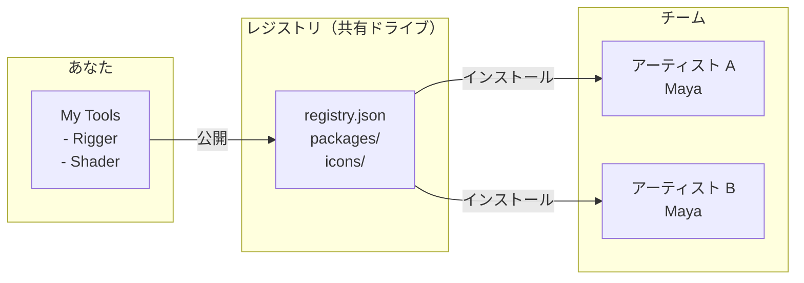
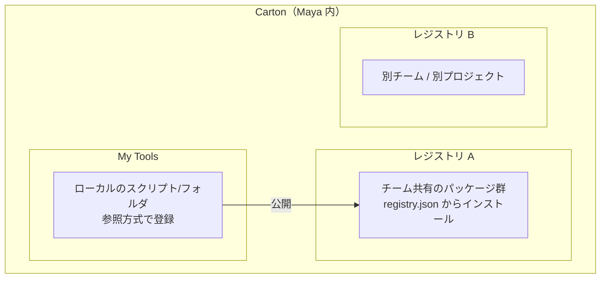

# Carton

Maya 用ローカルファーストのパッケージマネージャ。

[English version](README.md)

## Carton とは？

Carton は Maya ツールの**配布・インストール・更新**をクラウド不要で行えるパッケージマネージャです。共有ドライブやローカルディレクトリだけで運用できます。



**レジストリ** = `registry.json` とパッケージ群を含む共有フォルダ。
アクセス権があれば誰でもツールをインストールできます。

## 基本コンセプト



- **My Tools** — ローカル登録したスクリプト。参照方式なので、元ファイルの編集が即反映されます。
- **レジストリ** — パッケージをまとめた共有ディレクトリ。ローカルフォルダ、ネットワークドライブ、Git リポジトリ、リモート URL に対応。
- **公開（Publish）** — ローカルツールをパッケージ化してレジストリに追加。チームメンバーがインストール可能になります。

## 動作環境

- Maya 2024 / 2025 / 2026 / 2027

## クイックスタート

### Carton のインストール

1. [Releases](https://github.com/cignoir/carton/releases) からインストーラをダウンロード
2. Maya のビューポートに `.py` ファイルをドラッグ＆ドロップ
3. Maya を再起動
4. メニュー: **Carton > Open Carton**

### レジストリを使う

```
Settings（⚙）> Add > registry.json を選択
```

3 つのソースに対応:
- **ローカルファイル** — `registry.json` のパスを指定
- **GitHub リポジトリ** — `owner/repo` 形式
- **リモート URL** — `registry.json` の直接 URL

### ツールをインストール

Carton を開き、パッケージを選んで **Install** をクリック。

### スクリプトを登録・共有

```
My Tools > + Add > ファイルまたはフォルダを選択
                 > 名前、アイコン、説明を設定
                 > Register

カード > Publish > 公開先レジストリを選択
```

## レジストリの構成

```
my-registry/
├── registry.json          # パッケージ一覧
├── packages/
│   └── {namespace}/{name}/{version}/
│       └── {name}-{version}.zip
├── icons/
│   └── {name}.png         # パッケージごとのアイコン
└── icons.zip              # リモート配信用アイコン一括ファイル
```

Git で管理するもよし、ネットワークドライブに置くもよし、静的ファイルとしてホスティングするもよし。

## package.json

ツールのルートに配置するメタデータファイル:

```json
{
  "namespace": "mystudio",
  "name": "my_tool",
  "display_name": "My Tool",
  "version": "1.0.0",
  "type": "python_package",
  "description": "ツールの説明",
  "author": "your_name",
  "entry_point": {
    "type": "python",
    "module": "my_tool",
    "function": "show"
  },
  "icon": "🔧",
  "home_registry": { "name": "studio-main" }
}
```

対応タイプ: `python_package`, `mel_script`, `plugin`

### 識別子モデル

パッケージは **`namespace/name`**（npm 風、例: `mystudio/rigger`）で識別されます。
両方とも小文字 `a-z 0-9 - _`。`namespace` は **publish 時に必須**で、ローカル
個人用途のみのツールでは省略できます。

`namespace`／`name` を `package.json` に書き込んだら、**そのファイルを VCS に
コミット**してください。同じソースを clone した別の人が Add／Publish しても
自動で同じ識別子になり、レジストリ上で**同じパッケージの更新**として扱われます
（重複登録を防ぎます）。

### 単体ファイルスクリプト（サイドカー）

単体の `.py` / `.mel` / `.mll` には `package.json` を置く場所がないので、
Carton は**サイドカー** `<filename>.carton.json` を同じディレクトリに置きます:

```
tools/
├── quickRename.mel
└── quickRename.mel.carton.json   ← スクリプトと一緒にコミット
```

サイドカーの中身は `package.json` と同じスキーマです。初回 publish 時に Carton
が自動生成するので、生成されたファイルをコミットしてチームに行き渡らせてください。

## CLI

```bash
python -m carton list path/to/registry.json
python -m carton unpublish --registry path/to/registry.json --id mystudio/rigger
python -m carton migrate-registry --registry path/to/registry.json --namespace mystudio [--dry-run]
```

`migrate-registry` は旧 UUID キー方式のレジストリを `namespace/name` 方式に
アップグレードします: `registry.json` のキーを書き換え、保存済み zip 内の
`package.json` を全て展開→書き換え→再 zip し、`packages/<uuid>/...` ツリーを
`packages/<ns>/<name>/...` に再配置、`icons.zip` を再構築します。

## 開発

```bash
# インストーラのビルド
python scripts/build_installer.py

# テスト
python -m pytest tests/ -v

# Maya での開発リロード
exec(open(r"path/to/carton/scripts/dev_reload.py", encoding="utf-8").read())
```

## ライセンス

MIT
