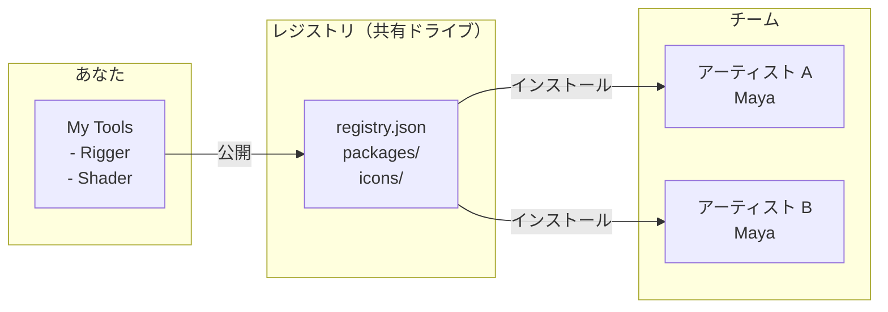

# Carton

Maya 向けのローカルファースト型パッケージマネージャー。

[English version](README.md)

## Carton とは

Carton は、Maya ツールの**配布・インストール・更新**をクラウドサービスなしで実現するパッケージマネージャーです。共有ドライブやローカルフォルダだけでチーム運用が完結します。



**レジストリ**とは、`registry.json` とパッケージ群を置いた共有フォルダのこと。アクセス権を持つメンバーなら、誰でもそこからツールをインストールできます。

## 主要コンセプト


- **My Tools** — ローカルのスクリプトを登録する作業エリア。参照方式なので、元ファイルを編集すればその場で反映されます。
- **レジストリ** — パッケージをまとめた共有ディレクトリ。ローカルフォルダ、ネットワークドライブ、Git リポジトリ、リモート URL のいずれにも対応します。
- **公開（Publish）** — My Tools のツールをパッケージ化してレジストリに追加し、チームメンバーがインストールできる状態にする操作です。

## 動作環境

- Maya 2024 / 2025 / 2026 / 2027

## クイックスタート

### Carton をインストールする

1. [Releases](https://github.com/cignoir/carton/releases) からインストーラをダウンロードします。
2. ダウンロードした `.py` ファイルを Maya のビューポートにドラッグ＆ドロップします。
3. Maya を再起動します。
4. メニューから **Carton > Open Carton** を選択します。

### レジストリを追加する

```
Settings（⚙）> Add > registry.json を選択
```

レジストリの追加元は次の 4 種類から選べます。

- **ローカルファイル** — `registry.json` のパスを指定します。
- **GitHub リポジトリ** — `owner/repo` 形式で指定します。
- **リモート URL** — `registry.json` の URL を直接指定します。
- **新規ローカルレジストリの作成** — 空フォルダを選ぶと、Carton が `registry.json` と `packages/` を自動生成します。

### ツールをインストールする

Carton を開き、パッケージを選んで **Install** をクリックするだけです。

ダウンロード時に Carton はレジストリ側の SHA256 と照合し、レジストリエントリにハッシュが記録されていれば、カードに ✔ マークを表示します。ハッシュ自体はレジストリの `version_entry.sha256` のみが正本として保持され（v0.4.0 以降、インストール側に重複保存しなくなりました）、UI はそこを参照します。

詳細パネルから **Version History** を開くと、各バージョンのリリースノートを確認したり、旧バージョンへロールバックしたりできます。ロールバック後のパッケージは自動的に **Pinned（固定）** 扱いとなり、以降の Update プロンプトで対象外になります。これにより、自分で選んだバージョンが意図せず上書きされる心配はありません。

### スクリプトを登録・共有する

```
My Tools > + Add > ファイルまたはフォルダを選択
                 > 名前、アイコン、説明を設定
                 > Register

カード > Publish > 公開先レジストリを選択し、リリースノートを書いて公開
```

タイプ別の詳しい登録手順は、後述の [マイツールへの登録](#マイツールへの登録) を参照してください。

なお、レジストリビューから「自分が公開したツール」をアンインストールしても、My Tools 側の登録は**消えません**。Carton は単にエントリを「ローカルスクリプト」状態に戻すだけなので、レジストリからのインストール状態とは独立して、編集や起動の設定を保持し続けられます。

## v0.3 からの移行

v0.4.0 では registry / installed.json のスキーマを **v4.0** に bump しました。旧形式のファイルは初回起動時に自動 migrate され、元ファイルは `installed.json.bak-v0.3.<ms>` / `registry.json.bak-v0.3.<ms>` として同じディレクトリにバックアップされます。

主な変更点：

- **各値の Source of Truth を一箇所に集約**しました。`entry_point` は zip 内 `package.json` のみ、`display_name` はレジストリのみ、`sha256` はレジストリの `version_entry` のみで保持され、インストール側で重複保存しなくなりました。
- **`source` enum を `["registry","local"]` の 2 値に縮約**しました。旧値（`"published"` / `"local_script"`）は自動変換されます。レジストリインストールと My Tools 登録の両方を持つ「双方向リンク」エントリは、`source="registry"` ＋ `local_path` の有無で表現されます。
- **`registry_id` (UUID) が `registry.json` の必須フィールド**になりました。最初の publish 時に自動 stamp されます。リモートのみで `registry_id` が無いレジストリには警告が出ます（ミラー判定が機能しないため、メンテナーが正本ファイルに stamp する必要があります）。
- **`icon` が `string | null` に統一**されました。旧来の `"icon": true`（`<name>.png` を自動解決）は文字列リテラル `"@auto"` に変換されます。
- **`platform` の override** 仕様: version レベルの `platform` 配列が指定されていればその version では package レベルを上書きし、未指定なら継承します。

レジストリ管理者の方は、migrate 後の `registry.json` をホスト先（S3、GitHub など）に再 upload してください。Carton 0.3.x クライアントも v4.0 のレジストリを引き続き読めますが、新しいフィールドは無視されます。

## プロファイル

**プロファイル**とは、レジストリ・プロキシ・言語・自動更新といった Carton 全体の設定を、まとめて切り替えるためのセットです。たとえば「会社用」「個人用」のプロファイルを作っておけば、レジストリを毎回入れ直すことなく、ワンクリックで Carton の挙動全体を切り替えられます。

プロファイルは JSON ファイルとして、次の場所に保存されます。

| OS | 保存先 |
|---|---|
| Windows | `~/Documents/maya/carton/profiles/` |
| macOS / Linux | `~/maya/carton/profiles/` |

組み込みの `default` プロファイルは常に存在します。追加のプロファイルは、サイドバーのプロファイルドロップダウン横にある歯車アイコンから **Profile Manager** を開いて管理します。

Profile Manager では、次の操作が行えます。

- **New** — 現在の Carton 設定をベースに、新しいプロファイルを作成します。
- **Edit** — レジストリ、プロキシ、言語、名前を変更します。
- **並び替え** — ▲▼ ボタンで、ドロップダウン上の表示順を入れ替えます。
- **Build Installer…** — 選択中のプロファイルを焼き込んだカスタムインストーラを生成します。配布先で初回起動した時点で、そのプロファイルが選択された状態になります。

プロファイルの切り替えは即時反映され、Maya の再起動は必要ありません。インストール済みのパッケージはすべてのプロファイルで共有され、プロファイルが切り替えるのは参照するレジストリ一覧やプロキシ・言語といった Carton 全体の設定だけです。

## 厳密な整合性検証

Settings には **「厳密な整合性検証」** チェックボックスがあります。これを有効にすると、Carton は次のように動作します。

- レジストリエントリに SHA256 が記録されていないパッケージのインストールを**拒否**します。
- ハッシュの不一致を**致命的なエラー**として扱います。

公開されてからインストールされるまでの間に、誰かがバイト列を改ざんしていないことを保証したいケース、つまり共有レジストリやリモートレジストリを利用する場面で有効化することを推奨します。

## レジストリの構成

```
my-registry/
├── registry.json          # パッケージ一覧
├── packages/
│   └── {namespace}/{name}/{version}/
│       └── {name}-{version}.zip
├── icons/
│   └── {name}.png         # パッケージごとのアイコン
└── icons.zip              # リモート配信用のアイコン一括ファイル
```

Git で管理する、ネットワークドライブに置く、静的ファイルとしてホスティングする — チームの運用に合わせて、好きな方法で配信できます。

## マイツールへの登録

「マイツール」は、ローカルにあるツールを**参照方式**で登録する作業エリアです。ファイルのコピーは作らないため、元ファイルを編集すればその場で反映されます。マイツールに登録したツールは、Publish によりレジストリへ共有できます。

Carton は複数のパッケージタイプに対応しており、登録時にタイプを自動判定します。以下、登録できるものとタイプごとの挙動を順に説明します。

### 1. 単体 Python スクリプト（`.py`）

```
tools/
└── quick_rename.py        # def show(): ...
```

**追加方法**: `+ Add > File` でファイルを選びます。Carton はファイル内から `def show / run / main / execute` を自動的に探し、関数名をプリフィルします。別の関数を使いたい場合は、ドロップダウンから選び直せます。

**実行モード**:
- **関数呼び出し**（関数が見つかった `.py` の既定モード）: ファイル名をモジュール名として import し、選択した関数を呼び出します（例: `import quick_rename; quick_rename.show()`）。
- **トップレベル実行**: ファイル全体を `exec()` で実行します。モジュールロード時に処理を行うタイプのスクリプトに向いています。

import が通るように、ファイルの親ディレクトリが `sys.path` に追加されます。

### 2. 単体 MEL スクリプト（`.mel`）

```
tools/
└── quickRename.mel        # global proc quickRename() { ... }
```

**追加方法**: ファイルを選択するだけです。Carton は MEL モードに切り替わり、拡張子を除いたファイル名を、スクリプト名およびプロシージャ名の既定値として使います。

起動時には `source "quickRename.mel"; quickRename();` を `maya.mel.eval` で実行します。ファイルのあるディレクトリは `MAYA_SCRIPT_PATH` に追加されます。

### 3. Maya プラグイン（`.mll`）

```
plug-ins/
└── exAttrEditor.mll
```

**追加方法**: ファイルを選択します。Carton は `.mll` 拡張子を検知すると、プラグインのディレクトリを `MAYA_PLUG_IN_PATH` に登録し、さらに**起動コマンド**フィールドを表示します。ここには、プラグインのロード後に実行する Python 式を入力します。例:

```python
import maya.cmds as mc; mc.exAttrEditor(ui=True)
```

起動ボタンをクリックすると、まだロードされていなければプラグインがロードされ、続いて指定したコマンドが実行されます。

### 4. フォルダパッケージ — Python（`python_package`）

`import` 可能な Python パッケージとして配布したいフォルダ向けです。

```
my_tool/
├── __init__.py            # def show(): ...
├── ui.py
└── package.json           # 任意のメタデータ
```

**追加方法**: `+ Add > Folder` でフォルダを選択します。Carton は次の順で処理します。

- `package.json` があれば、それを優先して読み取ります（推奨）。
- なければ、`__init__.py` から関数を探し、ツリーを走査してタイプを推定します。
- `import my_tool` が通るように、フォルダの**親ディレクトリ**を `sys.path` に追加します。

起動時には `import my_tool; my_tool.show()`（または選択した関数）を実行します。

フォルダルートに `package.json` を置いておくと、Carton は実行モード設定の UI を一切表示せず、メタデータを信頼してそのまま使います。チームでフォルダパッケージを共有するなら、この方法を推奨します。詳細は後述の [package.json](#packagejson) を参照してください。

### 5. フォルダパッケージ — MEL（`mel_script`）

```
my_mel_tool/
├── scripts/
│   └── myTool.mel         # global proc myTool() { ... }
└── package.json           # 任意、type: mel_script
```

**追加方法**: フォルダを選択します。Carton は `scripts/` ディレクトリ（無ければフォルダ自体）を `MAYA_SCRIPT_PATH` に追加し、その中で最初に見つかった `.mel` ファイルをスクリプトとして使います。起動時には `source "myTool.mel"; myTool();` を実行します。

### 6. Maya モジュール（`maya_module`） — Autodesk Application Package / `.mod`

サードパーティ製の Maya ツールで、もっとも一般的な配布形式です。`PackageContents.xml`（または `*.mod`）と、`Contents/scripts`、`Contents/plug-ins`、`Contents/icons`、そしてメニューやシェルフを登録する `userSetup.py` を含むフォルダ構成を取ります。

```
SIWeightEditor/
├── PackageContents.xml
└── Contents/
    ├── scripts/
    │   ├── userSetup.py
    │   └── siweighteditor/
    │       └── __init__.py
    ├── plug-ins/
    │   └── win64/2024/
    │       └── bake_skin_weight.py
    └── icons/
```

**追加方法**: フォルダを選択します。Carton はモジュール構造を検知し、次の処理を行います。

- `Contents/scripts` を `sys.path` と `MAYA_SCRIPT_PATH` に追加します。
- `Contents/plug-ins` を最大 3 階層まで走査し（`plug-ins/<plat>/<ver>/` のようなネスト構造を拾うため）、プラグインファイルを含む各ディレクトリを `MAYA_PLUG_IN_PATH` に追加します。
- `Contents/icons` を `XBMLANGPATH` に、`Contents/presets` を `MAYA_PRESET_PATH` に追加します。
- `userSetup.py` を `maya.utils.executeDeferred` 経由で実行し、モジュール自身のメニュー／シェルフ登録処理を走らせます。

カードのボタンは既定で**有効化（Activate）**になります（直接開くべき単一ウィンドウが無いためです）。有効化処理はセッション内で冪等なので、Activate を 2 回クリックしてもメニューが二重登録されることはありません。

#### 起動ボタンでメインウィンドウを直接開く

「有効化」ではなく「起動（Launch）」でモジュールの UI を直接開きたい場合は、カードを編集して**起動コマンド**フィールドにウィンドウを開く Python 式を入力します。SI Weight Editor の場合は次のとおりです。

```python
from siweighteditor import siweighteditor; siweighteditor.Option()
```

保存すると、ボタンの表示が「有効化」から「起動」に切り替わります。

#### 正しい起動コマンドの調べ方

エントリ関数の名前はツールごとに異なります。手間の少ない順に紹介します。

1. **モジュールの README やインストールガイドを読む** — 記載があれば、これが一番手っ取り早い方法です。
2. **既存のシェルフボタンからコマンドをコピーする** — シェルフボタンを右クリックして Edit を開けば、内部のコマンドが見えます。あるいは、Maya の **Script Editor → History → Echo All Commands** をオンにし、ツールのメニュー項目をクリックして、履歴に流れたコマンドを読み取る方法もあります。
3. **`userSetup.py` や `startup.py` を grep する** — `runTimeCommand`、`menuItem -command`、あるいは `register*command` のような呼び出しを探します。そこで指定されているコマンド文字列が、正規のエントリポイントです（SI Weight Editor の `siweighteditor.Option()` も、この方法で見つけました）。
4. **ソース内のトップレベル関数 `def show / main / Go / open / run` を探す** — 「メインウィンドウを開く」関数の慣習的な命名です。
5. **最終手段: `QMainWindow` / `QDialog` のサブクラスを直接インスタンス化する** — ただし注意が必要です。ツールによっては、エントリ関数の中でリソース読み込み・パス設定・プラグインロードといった重要な初期化を行っているため、ウィンドウクラスを直接インスタンス化すると UI が崩れることがあります。

### 7. フォルダパッケージ — `.mll` プラグイン同梱（`plugin`）

```
my_plugin/
├── plug-ins/
│   └── myPlugin.mll
├── scripts/
│   └── helper.py
└── package.json           # type: plugin
```

ヘルパースクリプトと一緒に配布したい `.mll` プラグイン向けの形式です。Carton は `plug-ins/` を `MAYA_PLUG_IN_PATH` に、`scripts/` を `sys.path` と `MAYA_SCRIPT_PATH` の両方に追加します。`package.json` で `entry_point.auto_load: true` を指定すれば、自動ロードも有効化できます。

### Namespace と内部名（Internal Name）

すべてのパッケージは、`quick_rename` や `ari-mirror` のような**内部名**（スラッグ）を持ちます。Add / Edit ダイアログでは読み取り専用で表示され、ファイル名やフォルダ名から自動生成されます。内部名はパッケージの安定識別子であり、**登録後は変更できません**（変更するとレジストリのエントリが孤立してしまうためです）。

**Namespace** フィールドは Add 時には任意で（個人用途のみのツールなら省略可能）、**公開時には必須**です。`MyStudio` のように入力すると自動的に `mystudio` に正規化され、入力欄の下に正規化後の形式がライブで表示されます。

## package.json

ツールのルートに以下のメタデータファイルを置きます。

```json
{
  "namespace": "mystudio",
  "name": "my_tool",
  "display_name": "My Tool",
  "version": "1.0.0",
  "type": "python_package",
  "description": "ツールの説明",
  "author": "your_name",
  "maya_versions": ["2024", "2025", "2026", "2027"],
  "entry_point": {
    "type": "python",
    "module": "my_tool",
    "function": "show"
  },
  "icon": "🔧",
  "home_registry": { "name": "studio-main" }
}
```

対応タイプ: `python_package`, `mel_script`, `plugin`, `maya_module`

`package.json` は `entry_point`、`maya_versions`、`icon` の **Source of Truth** です。Publisher がこれらを `registry.json`（プレビュー用）とパッケージ zip 内に転写します。インストール後は zip 内の `package.json` を読み直すため、registry や installed.json のキャッシュ値が古くても起動時の挙動には影響しません。

`icon` には次の値を指定できます。

- 絵文字（例: `"🔧"`）
- 相対ファイルパス（例: `"resources/icon.png"`）
- 文字列リテラル `"@auto"`（レジストリの `icons/<name>.png` を自動解決）
- `null`（アイコンなし）

### 識別子モデル

パッケージは **`namespace/name`** という npm 風の組み合わせで識別されます（例: `mystudio/rigger`）。どちらのフィールドも小文字 `a-z 0-9 - _` のみが使用可能です。`namespace` は**公開時には必須**ですが、共有を想定しないローカル個人用ツールでは省略できます。

`namespace` と `name` を `package.json` に書き込んだら、**そのファイルを必ず VCS にコミット**してください。同じソースをクローンした別のメンバーが Add や Publish を行っても、自動的に同一の識別子に揃うため、レジストリ上では「同じパッケージの更新」として正しく扱われ、重複登録を防げます。

### 単体ファイルスクリプト（サイドカー）

単体の `.py` / `.mel` / `.mll` には `package.json` を置く場所がありません。そのため Carton は、**サイドカーファイル** `<filename>.carton.json` を同じディレクトリに配置します。

```
tools/
├── quickRename.mel
└── quickRename.mel.carton.json   ← スクリプトと一緒にコミットする
```

サイドカーの中身は `package.json` と同じスキーマです。初回 publish の際に Carton が自動生成するので、生成されたファイルをコミットしてチームに行き渡らせてください。

## CLI

```bash
python -m carton list path/to/registry.json
python -m carton unpublish --registry path/to/registry.json --id mystudio/rigger

# レジストリの UUID を確認・stamp（v4.0 では必須フィールド）
python -m carton registry id path/to/registry.json
python -m carton registry id path/to/registry.json --stamp
```

## 開発

```bash
# インストーラのビルド
python scripts/build_installer.py

# テスト実行
python -m pytest tests/ -v

# Maya 上での開発リロード
exec(open(r"path/to/carton/scripts/dev_reload.py", encoding="utf-8").read())
```

## ライセンス

MIT
