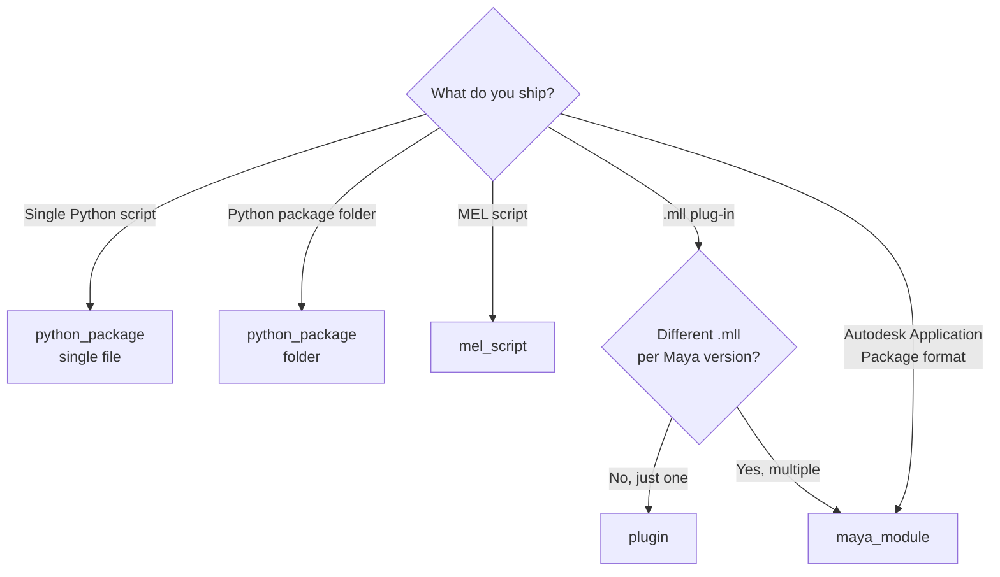

# Carton Developer Guide

This guide is written from the perspective of **building Carton-compatible
packages** — the "author" side. For the "user" side (installing tools via
Carton), see the [README](../README.md).

## Audience

- Developers retrofitting an existing Maya tool to be Carton-compatible
- Developers starting a new tool that should be Carton-ready from day one
- Studio admins running a Carton catalogue

## Quick Start

With [uv](https://github.com/astral-sh/uv) installed, the CLI runs without
any prior install:

```bash
mkdir my-tool && cd my-tool
uvx carton-maya package init    # interactive scaffold
uvx carton-maya package lint    # validate before committing
```

If you don't have uv yet: `pip install uv` or `pipx install uv`. `uvx` is
bundled with uv.

## Choosing a package type

Carton has four package types. Pick based on **what you ship** and **whether
your `.mll` differs across Maya versions**.



### Plug-in decision matrix

| Situation | Pick |
|---|---|
| One `.mll` for all Maya versions, optionally with Python helpers in `scripts/` | `plugin` |
| Different `.mll` per Maya version | `maya_module` |
| You want to ship as a `.mod` file | `maya_module` |
| Autodesk Application Package format (`PackageContents.xml`) | `maya_module` |
| Composite tool that registers menus via `userSetup.py` | `maya_module` |

**When in doubt, pick `maya_module`.** Maya itself dispatches based on
`MAYAVERSION:`, so you won't break anything when adding a new Maya version
later.

## package.json reference

A fully populated example:

```json
{
  "namespace": "mystudio",
  "name": "my_tool",
  "display_name": "My Tool",
  "version": "1.0.0",
  "type": "python_package",
  "description": "One-line description of the tool",
  "author": "your_name",
  "maya_versions": ["2024", "2025", "2026", "2027"],
  "platform": ["win64"],
  "tags": ["rigging", "animation"],
  "icon": "🔧",
  "entry_point": {
    "type": "python",
    "module": "my_tool",
    "function": "show"
  },
  "home_origin": {
    "type": "embedded",
    "catalogue_name": "studio-main"
  }
}
```

### Required fields

| Field | Description |
|---|---|
| `namespace` | Required to publish. Lowercase `a-z 0-9 - _` |
| `name` | Internal slug. Lowercase `a-z 0-9 - _`. **Cannot change after registration** |
| `display_name` | Shown in the UI |
| `version` | semver recommended |
| `type` | `python_package` / `mel_script` / `plugin` / `maya_module` |
| `entry_point` | Launch metadata (varies by type, see below) |

### `platform` (required when `type=plugin`)

```json
"platform": ["win64"]   // win64 / linux / mac, multiple allowed
```

The schema enforces this for `type=plugin`. Forgetting it triggers a lint
error.

### `maya_versions`

**Currently a display-only field.** Carton does not filter installs based on
this list. For per-version implementations, use `maya_module` with
`MAYAVERSION:` in the `.mod` file — see
[Distributing as a Maya Module](#distributing-as-a-maya-module).

### `icon`

| Value | Example | Behaviour |
|---|---|---|
| Emoji | `"🔧"` | Rendered as-is |
| Relative path | `"resources/icon.png"` | Loaded from inside the package |
| `"@auto"` | | Resolved against catalogue's `icons/<name>.png` |
| `null` | | No icon |

### `home_origin`

Where this package **wants to be published**. Carton warns when you try to
publish to a different origin (prevents accidental cross-catalogue
publishes).

```json
"home_origin": {"type": "embedded", "catalogue_name": "studio-main"}
"home_origin": {"type": "github", "repo": "mystudio/rigger"}
"home_origin": {"type": "url", "url": "https://example.com/pkg.json"}
"home_origin": {"type": "local", "path": "/path/to/folder"}
```

### `entry_point` by type

#### `python_package` — function-call mode

```json
"entry_point": {
  "type": "python",
  "module": "my_tool",
  "function": "show"
}
```

At launch: `import my_tool; my_tool.show()`.

#### `python_package` — exec mode (whole-file execution)

```json
"entry_point": {
  "type": "exec",
  "file": "my_tool.py"
}
```

The file is `exec()`'d. Use this for scripts that do their work at module
load time.

#### `mel_script`

```json
"entry_point": {
  "type": "mel",
  "script": "myTool.mel",
  "procedure": "myTool"
}
```

At launch: `source "myTool.mel"; myTool();`.

#### `plugin`

```json
"entry_point": {
  "type": "plugin",
  "plugin_file": "myPlugin",
  "commands": ["myCmd"],
  "nodes": ["myNode"],
  "ui_command": "myCmdUI",
  "auto_load": true
}
```

| Field | Description |
|---|---|
| `plugin_file` | Plugin name without extension. Passed to `loadPlugin` |
| `commands` | MEL commands the plugin registers (informational) |
| `nodes` | Nodes the plugin registers (informational) |
| `ui_command` | MEL function called when the user clicks Launch |
| `auto_load` | Auto-load the plugin at install time (optional, default `false`) |

#### `maya_module`

```json
"entry_point": {}
```

`maya_module` packages leave `entry_point` empty. The `.mod` or
`PackageContents.xml` file drives module activation; Carton does not read
`entry_point` for this type.

## Distributing as a Maya Module

The `maya_module` format is ideal for binary distributions where `.mll`
differs per Maya version, or composite tools that register menus / shelves
via `userSetup.py`.

### Folder layout

```
my-plugin/
├─ my-plugin.mod              ← manifest (any filename)
├─ plug-ins/
│  ├─ 2025/win64/my-plugin.mll
│  ├─ 2026/win64/my-plugin.mll
│  └─ 2027/win64/my-plugin.mll
├─ scripts/                   ← auto-added to MAYA_SCRIPT_PATH
│  └─ helpers.mel
├─ icons/                     ← auto-added to XBMLANGPATH (optional)
└─ userSetup.py               ← runs at startup (optional)
```

### `.mod` file contents

```
+ MAYAVERSION:2025 PLATFORM:win64 my-plugin 1.0.0 .
plug-ins: plug-ins/2025/win64

+ MAYAVERSION:2026 PLATFORM:win64 my-plugin 1.0.0 .
plug-ins: plug-ins/2026/win64

+ MAYAVERSION:2027 PLATFORM:win64 my-plugin 1.0.0 .
plug-ins: plug-ins/2027/win64
```

### Anatomy of a `+` line

| Token | Meaning |
|---|---|
| `+` | Activate this module |
| `MAYAVERSION:2025` | Match Maya 2025 only (**this is how per-version dispatch works**) |
| `PLATFORM:win64` | `win64` / `linux` / `mac` |
| `my-plugin` | Module name |
| `1.0.0` | Version |
| `.` | Base path (`.` = same folder as the `.mod` file) |

### Override lines

| Line | Effect |
|---|---|
| `plug-ins: <path>` | Adds to `MAYA_PLUG_IN_PATH` (relative to base) |
| `scripts: <path>` | Adds to `MAYA_SCRIPT_PATH` |
| `icons: <path>` | Adds to `XBMLANGPATH` |
| `presets: <path>` | Adds to `MAYA_PRESET_PATH` |

If you omit `scripts:` / `icons:`, Maya falls back to defaults
(`<base>/scripts`, `<base>/icons`).

### How Carton handles it

When you register a folder with a `.mod` file:

1. Carton detects the `.mod` and locks `type=maya_module`.
2. **Carton skips the extension-based folder scan** (`os.walk`) — so even if
   `devkits/` or `build/` mixes `.py` files into the tree, the type isn't
   misclassified.
3. At install time, Carton registers the folder on `MAYA_MODULE_PATH`.
4. At Maya startup, Maya itself reads the `.mod` and activates the `+`
   block matching the running Maya version.

## Carton CLI

Carton's CLI lets you author, validate, and manage packages and catalogues
without launching Maya.

### Command structure

```
uvx carton-maya <area> <command>

areas:
  package      Operate on individual packages (author-facing)
  catalogue    Operate on catalogues (publisher / admin-facing)
```

### `package` commands

| Command | Purpose |
|---|---|
| `init` | Interactive scaffold of a new package in the current directory |
| `lint` | Diagnose `package.json` and folder structure (warnings + errors, human-facing) |
| `check` | Lint in CI mode (exit code only, no warnings) |
| `pack` | Build a distributable zip |
| `schema` | Print the `package.json` JSON Schema (for IDE completion) |

#### `package init`

Scaffolds into the current directory (`npm init` style):

```bash
mkdir my-tool && cd my-tool
uvx carton-maya package init
? What kind of package?
  ❯ Python script (single .py)
    Python package (folder)
    MEL script
    Maya plugin (.mll)
    Maya module (.mod)
? Namespace: mystudio
? Name: my_tool
? Display name: My Tool
? Maya versions: [✓] 2024 [✓] 2025 [✓] 2026 [ ] 2027
✓ Created package.json + folder structure
```

#### `package lint`

```bash
uvx carton-maya package lint
✓ package.json schema valid
⚠ devkits/ contains 4000+ .py files — add to .gitignore?
✗ entry_point.module 'my_tool' has no __init__.py in expected location
```

Checks performed:
- `package.json` schema validation
- `entry_point` reference files exist (`.mll` / `.mel` / `__init__.py`)
- `type` and `entry_point.type` are consistent
- `platform` is set when `type=plugin`
- `namespace`/`name` follow slug rules
- **Warning for `devkits/` / `build/` / `node_modules/` / `.git/` mixed in**
- For `maya_module`: `.mod` / `PackageContents.xml` syntax
- For single-file packages: sidecar (`*.carton.json`) presence
- Icon reference paths exist

#### `package check`

Same checks as `lint`, but suppresses warnings and **returns an exit code
only**. Designed for CI:

```yaml
# .github/workflows/carton.yml
- run: uvx carton-maya package check
```

#### `package pack`

Builds a distributable zip outside Maya. Useful in CI right before publish.

#### `package schema`

Prints the `package.json` JSON Schema to stdout. Wire into your IDE for
auto-completion:

```bash
uvx carton-maya package schema > .vscode/carton-schema.json
```

### `catalogue` commands

| Command | Purpose |
|---|---|
| `list <path>` | List packages in a catalogue |
| `lint <path>` | Validate `catalogue.json` and all linked references |
| `migrate <path>` | Migrate v4.0 `registry.json` into v5.0 `catalogue.json` |
| `id <path>` | Show or stamp the `catalogue_id` (UUID) |
| `unpublish` | Remove a package from a catalogue |
| `schema` | Print the `catalogue.json` JSON Schema |

## Pre-publish checklist

Before publishing, verify each of these:

- [ ] **`uvx carton-maya package check` succeeds**
- [ ] **`namespace` and `name` are committed in `package.json`**
  - So that other people who clone your source converge on the same identity
    when they Add or Publish
- [ ] For single-file packages: **the `*.carton.json` sidecar is committed**
- [ ] **`devkits/` / `build/` / `node_modules/` / build artifacts are
      `.gitignore`'d**
- [ ] **`platform` is set if `type=plugin`**
- [ ] **For `maya_module`: `.mod` declares `MAYAVERSION:` for each target
      Maya version**
- [ ] Icon reference paths exist
- [ ] `home_origin` is set so accidental cross-catalogue publishes are
      caught

## Common pitfalls

### 1. devkits or build trees get misclassified as `python_package`

Carton's Add dialog scans the entire folder with `os.walk` and locks
`type=python_package` if any `.py` is found. If your folder includes
`devkits/MayaXXXX/` (Autodesk devkits ship with thousands of `.py` files)
or CMake build outputs containing `.py` helpers, a package that should be
`plugin` or `maya_module` is misclassified, and launch fails with
`ModuleNotFoundError`.

**Mitigations**:
- Place a `package.json` at the folder root (this completely skips the
  extension scan)
- Move build artifacts into a separate directory not registered with Carton
- Catch this early with `uvx carton-maya package lint`

### 2. Choosing `plugin` when `.mll` differs per Maya version

The `plugin` type only handles a single `.mll`. For separate Maya 2025 /
2026 / 2027 builds, **always use `maya_module`**.

### 3. Forgetting `MAYAVERSION:` in `.mod`

```
+ my-plugin 1.0.0 .             ← no MAYAVERSION → applies to all versions
```

This will load a 2026 `.mll` in Maya 2025 and crash. **Always declare
`MAYAVERSION:` per `+` block**.

### 4. Publishing without committing `namespace`/`name`

If a teammate clones the source without these committed, Carton regenerates
a different `name`, and the catalogue treats it as a separate package
instead of an update to yours. **Commit `namespace` and `name` in
`package.json`**.

### 5. Expecting `maya_versions` to filter installs

`maya_versions: ["2025"]` does **not** prevent install on other versions —
it's display metadata only. For version-specific behaviour, use
`maya_module`.

## References

- [README](../README.md) — Carton overview
- [design-faq.md](design-faq.md) — Intentional non-decisions (why no
  dependency resolution, why no Cartonfile, etc.)
- [package.schema.json](../schemas/package.schema.json) — Authoritative
  JSON Schema
- [catalogue.schema.json](../schemas/catalogue.schema.json) — Authoritative
  JSON Schema
- [examples/](../schemas/examples/) — Per-type `package.json` samples
