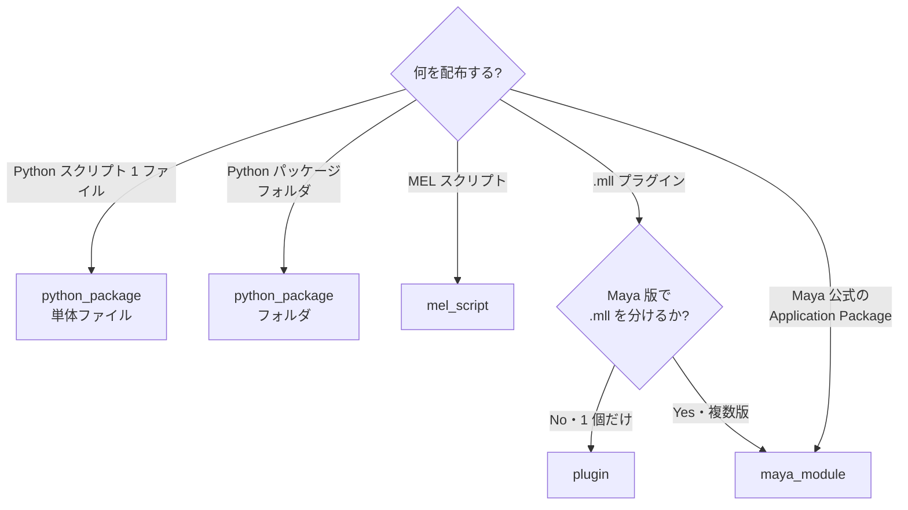

# Carton 開発者ガイド

このガイドは **Carton と互換性のあるパッケージを「作る」側** の視点でまとめています。Carton をツールマネージャとして「使う」側の操作は [README](../README_ja.md) を参照してください。

## 想定読者

- 既存の Maya ツールを Carton 互換に整えたい開発者
- 新規ツールを最初から Carton 互換で作り始めたい開発者
- スタジオで Carton カタログを運用する管理者

## クイックスタート

[uv](https://github.com/astral-sh/uv) が入っていれば、追加インストール不要で動きます：

```bash
mkdir my-tool && cd my-tool
uvx carton-maya package init    # 対話で雛形生成
uvx carton-maya package lint    # コミット前に検証
```

uv が未インストールなら `pip install uv` または `pipx install uv` で入れてください。`uvx` は uv に同梱されています。

## Maya 内での反復開発

作業中のコピーは Carton の **My Tools → 登録** で登録します——エントリは
ファイルをその場所のまま参照するだけで、コピーは作られません。
`dev_reload_my_tools` 設定（設定 → 一般、デフォルト ON）が有効なら、
起動のたびにキャッシュ済みモジュールを破棄してソースを読み直します。
編集 → 起動ボタン → 即反映、Maya の再起動は不要です。カタログから
インストールしたパッケージは速度優先でキャッシュ import のまま、
リロードされるのは自分の登録分だけです。

## パッケージタイプの選び方

Carton には 4 つのパッケージタイプがあります。**「何を配布するか」「Maya 版で実装が分かれるか」** で決まります。



### プラグイン系の判断ポイント

| 状況 | 選ぶタイプ |
|---|---|
| Maya 全バージョン共通の `.mll` 1 つ。`scripts/` に Python ヘルパー同梱可 | `plugin` |
| Maya 版で `.mll` を分けたい | `maya_module` |
| `.mod` ファイル形式で配布したい | `maya_module` |
| Autodesk 公式の Application Package 形式（`PackageContents.xml`） | `maya_module` |
| メニュー登録を `userSetup.py` で行う複合ツール | `maya_module` |

**迷ったら `maya_module` 推奨**。Maya が `MAYAVERSION:` で自動振り分けするので、将来 Maya 版を増やしても破綻しません。

## package.json リファレンス

すべてのフィールドを含む完全な例：

```json
{
  "namespace": "mystudio",
  "name": "my_tool",
  "display_name": "My Tool",
  "version": "1.0.0",
  "type": "python_package",
  "description": "ツールの一行説明",
  "author": "your_name",
  "maya_versions": ["2024", "2025", "2026", "2027"],
  "platform": ["win64"],
  "tags": ["rigging", "animation"],
  "icon": "🔧",
  "entry_point": {
    "type": "python",
    "module": "my_tool",
    "function": "show"
  },
  "home_origin": {
    "type": "embedded",
    "catalogue_name": "studio-main"
  }
}
```

### 必須フィールド

| フィールド | 説明 |
|---|---|
| `namespace` | 公開時必須。小文字 `a-z 0-9 - _` のみ |
| `name` | 内部名（slug）。小文字 `a-z 0-9 - _` のみ。**登録後変更不可** |
| `display_name` | UI 表示名 |
| `version` | semver 推奨 |
| `type` | `python_package` / `mel_script` / `plugin` / `maya_module` |
| `entry_point` | 起動方法（タイプ別、下記参照） |

### `platform` (`type=plugin` のとき必須)

```json
"platform": ["win64"]   // win64 / linux / mac から複数選択可
```

スキーマレベルで `type=plugin` 時は必須。書き忘れると lint で弾かれます。

### `maya_versions`

**現状はメタデータ（表示用）のみ**。インストール時の自動フィルタは行いません。Maya 版で実装が異なる場合は **`maya_module` 形式の `.mod` で `MAYAVERSION:` を使って振り分けてください**。詳細は [Maya Module として配布する](#maya-module-として配布する) を参照。

### `icon`

| 値 | 例 | 動作 |
|---|---|---|
| 絵文字 | `"🔧"` | そのまま表示 |
| 相対パス | `"resources/icon.png"` | パッケージ内のファイルを表示 |
| `"@auto"` | | カタログ側 `icons/<name>.png` を自動解決 |
| `null` | | アイコンなし |

### `home_origin`

このパッケージの **本籍となる公開先**。Carton はここに記録された origin 以外への publish 操作で警告を出します（誤って別カタログへ publish するのを防ぐ）。

```json
"home_origin": {"type": "embedded", "catalogue_name": "studio-main"}
"home_origin": {"type": "github", "repo": "mystudio/rigger"}
"home_origin": {"type": "url", "url": "https://example.com/pkg.json"}
"home_origin": {"type": "local", "path": "/path/to/folder"}
```

### タイプ別 `entry_point`

#### `python_package` — 関数呼び出しモード

```json
"entry_point": {
  "type": "python",
  "module": "my_tool",
  "function": "show"
}
```

`import my_tool; my_tool.show()` が起動時に実行されます。

#### `python_package` — exec モード（ファイル全体を実行）

```json
"entry_point": {
  "type": "exec",
  "file": "my_tool.py"
}
```

ファイルを `exec()` で実行します。モジュールロード時に処理を行うタイプのスクリプト向け。

#### `mel_script`

```json
"entry_point": {
  "type": "mel",
  "script": "myTool.mel",
  "procedure": "myTool"
}
```

起動時に `source "myTool.mel"; myTool();` を実行します。

#### `plugin`

```json
"entry_point": {
  "type": "plugin",
  "plugin_file": "myPlugin",
  "commands": ["myCmd"],
  "nodes": ["myNode"],
  "ui_command": "myCmdUI",
  "auto_load": true
}
```

| フィールド | 説明 |
|---|---|
| `plugin_file` | 拡張子なしのプラグイン名。`loadPlugin` に渡される |
| `commands` | 登録される MEL コマンド一覧（情報表示用） |
| `nodes` | 登録されるノード一覧（情報表示用） |
| `command` | ロード直後に実行する Python 文（MEL なら `ui_command` を使う） |
| `ui_command` | 起動ボタン押下時に呼ばれる MEL 関数 |
| `auto_load` | インストール時に自動ロード（任意、デフォルト `false`） |

#### `maya_module`

```json
"entry_point": {}
```

`maya_module` タイプは entry_point を空にします。`.mod` または `PackageContents.xml` がモジュールの起動を司るため、Carton は entry_point を読みません。

## Maya Module として配布する

Maya 版で `.mll` が分かれるバイナリ配布や、メニュー・シェルフ登録を `userSetup.py` に持つ複合ツールは `maya_module` 形式が最適です。

### フォルダ構成

```
my-plugin/
├─ my-plugin.mod              ← マニフェスト（ファイル名は何でも可）
├─ plug-ins/
│  ├─ 2025/win64/my-plugin.mll
│  ├─ 2026/win64/my-plugin.mll
│  └─ 2027/win64/my-plugin.mll
├─ scripts/                   ← MAYA_SCRIPT_PATH に自動追加
│  └─ helpers.mel
├─ icons/                     ← XBMLANGPATH に自動追加（任意）
└─ userSetup.py               ← 起動時実行（任意）
```

### `.mod` ファイルの中身

```
+ MAYAVERSION:2025 PLATFORM:win64 my-plugin 1.0.0 .
plug-ins: plug-ins/2025/win64

+ MAYAVERSION:2026 PLATFORM:win64 my-plugin 1.0.0 .
plug-ins: plug-ins/2026/win64

+ MAYAVERSION:2027 PLATFORM:win64 my-plugin 1.0.0 .
plug-ins: plug-ins/2027/win64
```

### `+` 行の各部分の意味

| 部分 | 意味 |
|---|---|
| `+` | このモジュールを有効化 |
| `MAYAVERSION:2025` | Maya 2025 起動時のみマッチ（**Maya 版振り分けの核**） |
| `PLATFORM:win64` | `win64` / `linux` / `mac` |
| `my-plugin` | モジュール名 |
| `1.0.0` | バージョン |
| `.` | ベースパス（`.` = `.mod` と同じフォルダ） |

### 上書き行

| 行 | 動作 |
|---|---|
| `plug-ins: <path>` | `MAYA_PLUG_IN_PATH` への追加（ベースからの相対） |
| `scripts: <path>` | `MAYA_SCRIPT_PATH` への追加 |
| `icons: <path>` | `XBMLANGPATH` への追加 |
| `presets: <path>` | `MAYA_PRESET_PATH` への追加 |

`scripts:` `icons:` 行を省略するとデフォルト（`<base>/scripts`、`<base>/icons`）が自動的に使われます。

### Carton 上の挙動

`.mod` ファイルがあるフォルダを Carton に登録すると：

1. Carton が `.mod` を検出して `type=maya_module` 確定
2. **拡張子スキャン（`os.walk`）をスキップ** → `devkits/` `build/` などが混じっていても誤判定しない
3. インストール時に `MAYA_MODULE_PATH` に登録
4. Maya 起動時、Maya 自身が `.mod` を読んで現在のバージョンに合う `+` ブロックを発火

## Carton CLI

Maya を起動せずに、Carton 互換パッケージを作成・検証・カタログ操作するための CLI です。

### コマンド体系

```
uvx carton-maya <area> <command>
uvx carton-maya --version

areas:
  package      個別パッケージの操作（開発者向け）
  catalogue    カタログの操作（配布者・管理者向け）
```

### `package` コマンド

| コマンド | 役割 |
|---|---|
| `init` | 対話で新規パッケージの雛形をカレントディレクトリに生成 |
| `lint` | package.json と構造の警告込み診断（人間向け） |
| `check` | lint の非対話版（exit code のみ、CI 用） |
| `pack` | 配布 zip をビルド |
| `schema` | package.json の JSON Schema を出力（IDE 補完用） |

#### `package init`

カレントディレクトリに雛形を展開（`npm init` 流）：

```bash
mkdir my-tool && cd my-tool
uvx carton-maya package init
? Package type?
  ❯ python_package
    mel_script
    plugin
    maya_module
? Package name (snake_case)? my_tool
? Namespace (publisher id, e.g. mystudio — required to publish, empty to skip)? mystudio
? Display name? My Tool
? Initial version? 0.1.0
? One-line description? 選択コントロールをミラーする
? Author? you
? Maya versions? [✓] 2024 [✓] 2025 [✓] 2026 [ ] 2027
Scaffolded my_tool (python_package) at /path/to/my-tool
  package.json
  my_tool/__init__.py
```

各プロンプトにはフラグが対応する（`--type` `--name` `--namespace`
`--display-name` `--version` `--description` `--author`
`--maya-versions` `--platform`）。`--non-interactive` で全プロンプトを
スキップしてデフォルト埋めできる。namespace を空でスキップした場合は
`package.json` にフィールド自体が入らないので、publish 前に追記すること。

#### `package lint`

```bash
uvx carton-maya package lint
✓ package.json schema valid
⚠ devkits/ contains 4000+ .py files — add to .gitignore?
✗ entry_point.module 'my_tool' has no __init__.py in expected location
```

主なチェック項目：
- package.json スキーマ検証
- `entry_point` の参照ファイル実在確認（`.mll` / `.mel` / `__init__.py`）
- `type` と `entry_point.type` の整合
- `type=plugin` のとき `platform` 必須
- `namespace/name` の slug 規則
- **`devkits/` `build/` `node_modules/` `.git/` 等の混入警告**
- `maya_module` 時の `.mod` / `PackageContents.xml` 構文検証
- 単体ファイル時のサイドカー（`*.carton.json`）存在確認
- アイコン参照の実在確認

#### `package check`

`lint` と同じ検証を行い、警告は出さず **exit code のみ** で結果を返します。CI パイプライン用：

```yaml
# .github/workflows/carton.yml
- run: uvx carton-maya package check
```

#### `package pack`

Maya 外で配布用 zip をビルドします。CI で publish する直前に使う想定。

#### `package bundle`

`python_package` を 1 枚の `.py` に畳みます。Carton を持っていない人に
ツールを渡すためのものです。渡された側は scripts フォルダに置いて import
するか、ASCII だけの 2 行を貼って UTF-8 として読み込みます。ロケールが
UTF-8 でない Windows では、非 ASCII を含むソースを丸ごと貼ると文字化けする
ことがあるので、この 2 行が効きます。

```bash
uvx carton-maya package bundle              # <package>_standalone.py を書き出す
uvx carton-maya package bundle --check      # コミット済みのものが最新か
uvx carton-maya package bundle --plan       # 何が畳まれるか / 何が邪魔しているか
```

中身はパッケージのソースを依存順に並べたものなので、普通に読めますし直せます
（ただし直すならパッケージ側を直して作り直すこと）。生成物をコミットして CI で
`--check` を回せば、パッケージだけ直して配布物が古いまま、という事故を防げます。

畳まれるのはエントリポイントから実際に到達するモジュールだけです。誰も import
していない Maya プラグインやシェルフ用のヘルパーは、そのまま外に残ります。

1 つの名前空間に畳むのは常に安全とは限らず、**間違った単体ファイルは無いより
たちが悪い**です（名前が黙って別の定義に解決されることがある）。循環 import、
同じトップレベル名を持つモジュールが 2 つある、import 中に `__file__` を読む、
のいずれかがあると、推測せずに拒否します。何が邪魔しているかは `--plan` が出します。

実行時に読むデータも一緒に運べます。package.json で指定します：

```json
"bundle": { "data": ["presets/*.json"] }
```

指定したファイルは ASCII エスケープした `BUNDLED_DATA` として埋め込まれます。
パッケージ側はその名前を見に行き、無ければ従来どおりディスクを読む、と書いて
おけば、1 つのコードで両方に対応できます。

#### `package schema`

`package.json` の JSON Schema を stdout に吐きます。IDE の JSON 補完設定に使えます：

```bash
uvx carton-maya package schema > .vscode/carton-schema.json
```

### `catalogue` コマンド

| コマンド | 役割 |
|---|---|
| `list <path>` | カタログ内のパッケージ一覧 |
| `lint <path>` | catalogue.json + リンク先全体の検証 |
| `migrate <path>` | v4.0 registry.json を v5.0 catalogue.json に変換 |
| `id <path>` | catalogue_id (UUID) の確認・stamp |
| `unpublish` | カタログからパッケージを除去 |
| `schema` | catalogue.json の JSON Schema を出力 |

## 公開前チェックリスト

publish 前にこれらを満たしているか確認してください：

- [ ] **`uvx carton-maya package check` が成功する**
- [ ] **`namespace/name` を `package.json` に記載して VCS にコミットしている**
  - 別メンバーが同じソースをクローンして Add や Publish しても同一識別子に揃うため
- [ ] 単体ファイルパッケージなら **`*.carton.json` サイドカーを VCS にコミット**している
- [ ] **`devkits/` `build/` `node_modules/` などのビルド成果物・外部資材を `.gitignore` で除外**している
- [ ] **`type=plugin` なら `platform` フィールドを記載**している
- [ ] **`maya_module` 形式なら `.mod` の `MAYAVERSION:` で対応バージョンを明示**している
- [ ] アイコン参照のパスが実在する
- [ ] `home_origin` を記載して、誤って別カタログに publish されないようにしている

バージョン番号を事前に手で確認する必要はありません。公開先のカタログに既に存在するバージョンとぶつかった場合、Carton が空いている次の patch を提示し、そのまま publish できます。既に出ているバージョンは飛ばして探すため、二度目の衝突で往復させられることもありません。

## よくある落とし穴

### 1. devkits や build が誤って `python_package` 判定される

Carton の Add ダイアログは、フォルダ全体を `os.walk` でスキャンして `.py` が見つかると `python_package` 判定します。`devkits/MayaXXXX/` など Autodesk devkit 配下や CMake ビルド生成物に大量の `.py` が含まれていると、本来 `plugin` / `maya_module` であるべきパッケージが誤って Python パッケージ扱いされ、起動時に `ModuleNotFoundError` が発生します。

**対策**:
- フォルダ直下に `package.json` を置く（拡張子スキャンを完全スキップする）
- ビルド成果物は別ディレクトリに分離して登録対象から外す
- `uvx carton-maya package lint` で事前検出できる

### 2. Maya 版で `.mll` が分かれるのに `plugin` を選んでしまう

`plugin` タイプは `.mll` を 1 つしか扱えません。Maya 2025 / 2026 / 2027 で別ビルドが必要な場合は **必ず `maya_module` 形式** を選んでください。

### 3. `.mod` の `MAYAVERSION:` を書き忘れる

```
+ my-plugin 1.0.0 .             ← MAYAVERSION なし → 全バージョンに適用される
```

これだと Maya 2025 で 2026 用の `.mll` をロードしようとしてクラッシュします。**必ず `MAYAVERSION:` で対象バージョンを明示**してください。

### 4. `namespace/name` を VCS にコミットせずに公開した

別の人が同じソースをクローンして Carton に登録すると、別の `name` で再生成されてしまい、カタログ上で「同じパッケージの更新」として扱われません。`package.json` の `namespace/name` は必ずコミットしてください。

### 5. `maya_versions` で振り分けされると思い込む

`maya_versions: ["2025"]` と書いても **Carton はインストールを拒否しません**。これは表示用メタデータです。バージョン依存の挙動が必要なら `maya_module` 形式を使ってください。

## 参考リンク

- [README](../README_ja.md) — Carton 全体の概要
- [design-faq.md](design-faq.md) — 意図的に採用しなかった設計判断（依存解決がない理由など）
- [package.schema.json](../schemas/package.schema.json) — 公式 JSON Schema
- [catalogue.schema.json](../schemas/catalogue.schema.json) — 公式 JSON Schema
- [examples/](../schemas/examples/) — タイプ別 package.json サンプル
